# LEVIO Python 版在 odom_dataset 上的 18 段单目视觉惯性验证

本报告固定 `research` 分支代码、数据版本及容器环境。估计器只接收 D435i 的单路彩色图像和飞控原始 IMU：RGB 转灰度后按 20 Hz 取帧，IMU 保持原始采样率。深度、第二相机、LiDAR、ToF 和记录里程计均不参与 LEVIO 状态估计。

**参考轨迹的证据等级。** odom_dataset bag 中的 `/fusion_odometry/lazy_point_odom` 是记录的融合里程计；[固定版本数据卡](https://huggingface.co/datasets/YangLiu1021/odom_dataset/blob/6ac394eef603e8efbfdc9d15f718e85835eee6bb/README.md)没有定义其生成算法和独立误差，因此不能认定它是 LIO 真值。[TIO-Former 论文 v2](https://arxiv.org/pdf/2609.17198v2)说明其飞行真值由外部动捕记录，但未证明公开 bag 中的这个话题就是该动捕真值。下文 odom_dataset 的米制误差均指**与记录里程计的差**。EuRoC 使用独立运动真值，两组数字不作跨数据集排名。

## 1. 从干净容器开始复现

在仓库根目录执行下列命令。宿主机只需 Git、Docker、curl、sha256sum 和常见 shell 工具；Python、ROS、OpenCV、GTSAM 及绘图依赖均在容器中安装。bag、日志和逐帧结果放在 Git 忽略的 `research_data/`、`research_results/`。正式清单固定为已完整下载和校验的 18 段，合计 140,268,987,261 字节（约 130.64 GiB）；未完成下载的 run031/run033 不纳入结果。下载脚本只获取清单指定的 bag，已存在且哈希正确的文件会直接跳过。

```bash
git clone https://github.com/superboySB/levio.git
cd levio
git switch research
docker image rm levio-research:py310 2>/dev/null || true
docker build --pull --no-cache -f docker/research.Dockerfile \
  -t levio-research:py310 .
```

先检查 EuRoC 与上游 `main`，再运行新数据集。所有下载命令、固定版本、字节数和 SHA-256 校验都在本仓库中，下载中断后可续传。

```bash
research/download_euroc.sh
mkdir -p research_data research_results research/figures
docker run --rm --user "$(id -u):$(id -g)" -v "$PWD:/workspace/levio" \
  levio-research:py310 python research/run_euroc.py \
  --output research_results/MH01_euroc_full \
  --trace-output research_results/MH01_euroc_full/runtime_match_trace.csv \
  > research_data/MH01_euroc_full.log 2>&1
docker run --rm --user "$(id -u):$(id -g)" -v "$PWD:/workspace/levio" \
  levio-research:py310 python research/plot_results.py \
  --run-dir research_results/MH01_euroc_full \
  --output research/figures/MH01_euroc_full.svg
research/check_upstream_euroc.sh
docker run --rm --user "$(id -u):$(id -g)" -v "$PWD:/workspace/levio" \
  levio-research:py310 python research/compare_euroc_paper.py \
  --run-dir research_results/MH01_euroc_full \
  --output research_results/MH01_paper_protocol_diagnostic.json
```

```bash
research/download_bags.sh
research/run_all.sh
research/check_upstream_odom.sh
research/run_diagnostics.sh
research/run_ablations.sh
research/run_startup_sensitivity.sh
research/run_input_adaptation.sh
docker run --rm --user "$(id -u):$(id -g)" -v "$PWD:/workspace/levio" \
  levio-research:py310 python research/check_alignment.py
docker run --rm --user "$(id -u):$(id -g)" -v "$PWD:/workspace/levio" \
  levio-research:py310 python research/audit_startup_dynamics.py
docker run --rm --user "$(id -u):$(id -g)" -v "$PWD:/workspace/levio" \
  levio-research:py310 python research/audit_image_quality.py --dense-all
docker run --rm --user "$(id -u):$(id -g)" -v "$PWD:/workspace/levio" \
  levio-research:py310 python research/cohort_report.py
docker run --rm --user "$(id -u):$(id -g)" -v "$PWD:/workspace/levio" \
  levio-research:py310 python research/segment_report.py
docker run --rm --user "$(id -u):$(id -g)" -v "$PWD:/workspace/levio" \
  levio-research:py310 python research/make_source_brief.py
docker run --rm --user "$(id -u):$(id -g)" -v "$PWD:/workspace/levio" \
  levio-research:py310 python research/build_note_results.py
```

若只复核数据适配、原 `main` 对照和典型失效机制，可先用约 6.08 GiB 的 run003/005/007/009 子集：

```bash
research/download_bags.sh run003 run005 run007 run009
research/run_all.sh run003 run005 run007 run009
```

上面的子集不代表 18 段统计；生成本报告的完整表仍需固定清单中的 18 段。

`run_all.sh` 对每段先执行完整时间轴审计，合格后才运行 VIO、记录实际运行时的帧对并绘图。`cohort_report.py` 只有清单恰有 18 段默认数据、全部通过审计且输出自洽时才返回成功。每段的 `summary.json`、原始采集时间 `capture_times.txt`、每帧当刻位姿 `online_frames.tum`、完整运行结束后的 `frames.tum` 和 `runtime_match_trace.csv` 位于 `research_results/<bag>_color_20hz/`。主指标只读取 `online_frames.tum`；`frames.tum` 用于上游源码输出对照。

论文原 PDF 的[固定版本直链](https://arxiv.org/pdf/2602.03294v1)可用 `research/download_paper.sh` 下载到被忽略目录并校验 SHA-256。仓库保留可再生成的[研究材料摘要](research/assets/source_brief.md)及其[小型 PDF](research/assets/source_brief.pdf)；[既有调研对话](https://chatgpt.com/share/6abb7607-6e20-83ec-b80e-76f04bd354a8)提供背景，关键技术陈述均按论文、公开源码及本次运行重新核对。原论文页面采用 [arXiv 非独占发行许可](https://arxiv.org/licenses/nonexclusive-distrib/1.0/license.html)，仓库提供官方原文链接和固定哈希下载命令，不再分发其约 13 MB 全文。标定、session 元数据与数据许可均随本仓库的 `research/` 目录提供。

## 2. EuRoC：先核对公开 Python 路径和论文口径

[LEVIO 论文](https://arxiv.org/html/2602.03294)第 III-B 节描述 ORB 特征和 8 点本质矩阵 RANSAC；第 IV-A 节说明 EuRoC MH01–MH05 经参数搜索，用 [RPG trajectory evaluation](https://github.com/uzh-rpg/rpg_trajectory_evaluation) 计算误差。表 V 中标准分辨率 MH01 的 ATE RMSE 是 **0.96 m**。论文未给出表 V 的完整最终参数、RPG 配置、时间关联和轨迹截取范围，无法从论文文字唯一重建该数值协议。

[公开 LEVIO 源码](https://github.com/ETH-PBL/levio)的 Python `main` 默认路径实际用 GFTT/Harris、oriented BRIEF，并直接调用 OpenCV `findEssentialMat`，没有匹配数不足、空描述子或本质矩阵求解失败的完整保护；它与论文所述 ORB/8 点前端不完全相同。研究分支为完整处理新数据，要求 E 分支至少 8 个匹配，并在无有效单一 E 时保护性跳过该帧。因此后文明确区分原 `main` 的可运行前缀与带保护的研究分支完整输出，不能把两者称为无条件等价，更不能将其称为论文完整参数配置。

EuRoC MH_01_easy 使用左相机 `/cam0/image_raw` 与 `/imu0`，保留原项目相机内参、畸变及相机—IMU 外参。bag 与真值 CSV 分别来自脚本固定版本的 Hugging Face 和 OpenVINS 镜像，下载时检验 SHA-256；真值的 IMU 位姿按外参转到相机中心。新建容器全段处理 **3,682 帧**，第 **31 帧**完成初始化（零起算）。`check_upstream_euroc.sh` 导出本仓库原 `main` 提交 `00d925f166bff859496fbda85049b2ce68bf7aa1` 并在相同容器、bag 和包装程序下运行：前 300 帧和全段的 `frames.tum`、`keyframes.tum`、`online_frames.tum` 与研究分支均逐字节一致。这证明本分支没有改变 EuRoC 默认 Python 路径输出。

下表使用同一份在线轨迹，按 20 ms 最近邻匹配相机中心真值。首位姿固定 SE(3) 只由第一对匹配位姿决定，起点严格重合；最佳 SE(3) 与 Sim(3) 使用全窗口位置作事后最小二乘拟合，Sim(3) 还拟合尺度，仅作协议敏感性诊断。

| MH01 窗口 | 匹配帧 | 首位姿固定 SE(3) RMSE | 全程最佳 SE(3) RMSE | 全程最佳 Sim(3) RMSE | Sim(3) 尺度 |
|---|---:|---:|---:|---:|---:|
| 初始化后 | 3,630 | 4.406 m | 2.470 m | 2.068 m | 1.552 |
| 全部录制帧，仅诊断 | 3,639 | 4.411 m | 2.473 m | 2.070 m | 1.554 |


即使允许全程尺度拟合，公开默认 Python 输出在上述协议下仍为 2.068 m。同一在线输出在初始化后前 10 s 的首位姿 RMSE 为 0.087 m，而全段为 4.406 m，说明短窗口数字不能替代长程漂移。不能据此断言论文 0.96 m 错误，也不能声称已经严格复现：前端、调参结果和 RPG 评价配置未完全对应。EuRoC 的源码一致性排除了本分支改变默认 EuRoC 路径的可能，但没有证明 odom_dataset 的新标定、固定时偏或原 Python 默认模型在新场景中已经正确。

`check_upstream_odom.sh` 让原 `main` 和研究分支读取**相同的** D435i RGB 转灰度图、飞控 raw IMU、标定与 20 Hz 帧序列，仅切换 VIO 核心。run007 的 709 帧全段 `frames.tum`、`keyframes.tum` 和在线轨迹逐字节一致。run005 的原 `main` 在处理 frame201 时，地图点描述子列表为空却仍传给 OpenCV 匹配器，因描述子类型不符而中止；当前图像本身仍有 83 个特征点。其前 201 帧在线轨迹与研究分支逐字节一致。研究分支的空地图描述子与 E 失败保护使后续诊断成为可能，同时会改变原 `main` 原本无法产生输出的时段。因此新数据集的完整段结果应称为**带明确保护的 Python 模型结果**，不是原 `main` 在该数据集上的未修改完整运行。

## 3. odom_dataset 的输入与标定

18 段数据来自 [Hugging Face odom_dataset](https://huggingface.co/datasets/YangLiu1021/odom_dataset)，固定 revision `6ac394eef603e8efbfdc9d15f718e85835eee6bb`。每段的 session ID、bag 字节数、SHA-256、默认或可选状态列在 [bags.tsv](research/metadata/bags.tsv)；原始 session 元数据、[标定模板](research/calibration/camera_infra1.yaml)和[数据许可](research/DATA_LICENSE.md)均在项目内。公开数据卡列出 52 段中仅 28 段有彩色话题，并明确本发布版没有固定训练/验证/测试划分或基准协议。因此正式选择依据完整 bag 的原始消息审计，不依赖话题是否存在或元数据平均频率。

正式输入为 D435i 的 `/camera/color/image_raw` 和**飞控而非 D435i 内置 IMU** 的 `/mavros/imu/data_raw`。`run_odom.py` 从逐段 `/camera/color/camera_info` 读取内参与畸变，并检查同一 bag 内恒定；已审计数据为 640×480，`fx≈603.509`、`fy≈603.286`、`cx≈334.386`、`cy≈250.232`，畸变系数 `D=[0,0,0,0,0]`，没有沿用 EuRoC 相机参数。机体至彩色相机的外参由仓库内左红外模板与 bag `/tf_static` 计算：

```text
T_base_color = T_base_infra1 · inverse(T_link_infra1) · T_link_color
```

所得平移约 `[0.051764, 0.029380, -0.036306] m`。飞控原始 IMU 的 `frame_id=base_link`，该变换供 LEVIO 设置相机与 IMU 坐标关系；源码的 IMU 测量变换实际只用外参旋转，**没有平移杠杆臂补偿**。随 bag 提供的 session 元数据将模板标为 `robot_v1_template`，质量状态为 `unchecked`。模板外参对每个 session 的准确性、相机与飞控 IMU 的固定时间偏移尚未被独立联合标定。“已传入 D435i 参数”不等于“跨传感器标定误差已排除”。

各段随附的 `topic_summary.yaml` 还显示，run011/016/014/034/020/033/032 的 `/livox/lidar` 最后消息分别比彩色 RGB 早约 8.785/3.145/13.202/8.427/15.238/6.146/9.134 s，而融合里程计仍持续到接近 RGB 结束。这个记录事实不能辨认融合里程计在末段是否依赖 LiDAR、IMU 传播或别的输入，因此也不能凭话题名称把它标为“LIO 真值”；它本身不构成 LEVIO 误差的因果解释。

## 4. 时间轴审计与评价定义

`audit_rgb.py` 检查完整 bag 中 RGB `header.stamp` 严格递增、相邻间隔不超过 50 ms、序号连续、编码及图像字节长度完整；原始 IMU 最大间隔不超过 100 ms、全程 `frame_id=base_link`、RGB 至最近 IMU 时间戳不超过 50 ms，且头尾覆盖；记录里程计最大间隔不超过 200 ms。它另记录参考位置的米级单步跳变，供指标解读，不以参考位置跳变否定 RGB/IMU 输入的完整性。VIO 仅裁去 RGB、IMU、参考轨迹共同时间区间外的边界图像。这是**记录时间戳覆盖与连续性**的操作性判据；100 ms IMU 阈值仍容许局部采样停顿，逐段最大间隔在结果表列出，不能理解为每 5 ms 都有样本，也不能证明相机曝光与飞控 IMU 的物理时钟零偏为零。审计不合格的 bag 保留为可选证据，不插帧或合成 IMU 来凑足目标数量。

每次 `process_frame` 返回后，立即把当刻相机位姿及原图像 `header.stamp` 写入在线轨迹，未来图优化不会改写它。参考里程计的 `world→base_link` 位姿先乘 `T_base_color`，变换到**同一相机中心**；20 ms 最近邻时间匹配。米制评分仅从视觉惯性初始化后的第一对匹配位姿开始，遇到首次本质矩阵恢复失败便截止；后续保护性续跑只作失效诊断。

若第一对匹配位姿为 `T_est,0` 和 `T_ref,0`，只计算一次 `T_align=T_ref,0 · inverse(T_est,0)`；之后每帧只左乘这个固定 SE(3)，不拟合后续位置或尺度。因此有米制评分的叠绘轨迹中，三维预测与参考起点及姿态重合，后续差异表示从共同物理初位姿出发的在线累计偏差。先前使用全程最优 SE(3) 所产生的起点错位，在本版图和主指标中已消除；该最优拟合只保留在 EuRoC 协议敏感性表中。RMSE 是评分窗口逐时三维位置差的均方根；端点差是最后一对位置差；EDR 为端点差除以**同一评分窗口**的参考累计路径长。这个 EDR 形式对应 [TIO-Former 第 IV-A 节的端点漂移定义](https://arxiv.org/pdf/2609.17198v2)；该论文以动捕真值路径长为分母、从共同初位姿做开放环积分，本报告 odom_dataset 的分母是**记录里程计**同窗口路径长，故只是同形式的参考相对 EDR，不能当作真值漂移率或直接与其表 I 数值排名。路径长比受轨迹抖动和跳变影响，不能解释为单一尺度因子。未初始化的单目 VIO 没有确认的米制尺度，不报告米制定位误差。

`summary.json` 另保留仅平移锚定的 `start_anchored_*` 及全程最优拟合的 `se3_aligned_*` 供排错；本报告的主表、图和 EDR **统一读取 `initial_pose_aligned_*`**，三者不得混列。`check_alignment.py` 的合成输入要求起点误差为零，且注入 0.25 m 终点误差后计算值不变。绘图程序再次校验在线轨迹、原采集时间、RMSE、端点、EDR、路径长及匹配帧数的一致性。只在有有效初始化后评分区间时叠绘米制轨迹；其余情况显示特征与关键帧诊断。`compare_fixed_window.py` 的“前 10 s”诊断从初始化后的首个匹配姿态计算；不足 10 s 的记录如 run009 只按实际可用的 4.74 s 评分，并标明截短状态，不能并入严格等长窗口统计。

## 5. 候选筛选与完整输入的含义

清单中的默认 cohort 固定为 18 段；审计在**完整原始 bag**上完成，不按回放时的 20 Hz 子采样结果推断原始 RGB 是否丢帧。另有五段候选因输入或参考时间轴不完整而被排除，既有审计结果列于下表；它们不参与正式 18 段复现。若要独立复核这些排除判据，需另外下载约 39.81 GiB 的 bag 并运行以下可选命令。`run_all.sh` 对不合格数据返回状态码 2，详细时间戳计数写入 `research_results/rgb_audit/<label>.json`。

```bash
research/download_bags.sh run014 run017 run023 run025 run028
for label in run014 run017 run023 run025 run028; do
  if research/run_all.sh "$label"; then
    echo "Unexpectedly passed: $label" >&2
    exit 1
  else
    status=$?
    test "$status" -eq 2 || exit "$status"
  fi
done
```

| 候选 | 原始记录证据 | 处理 |
|---|---|---|
| run014 | RGB 6107 帧连续，但 raw IMU 有一次 −3.938 ms 时间戳倒序；参考里程计另有 5.118 m/5.005 ms 跳变。 | 排除 |
| run017 | RGB 最长间隔 967 ms、序号累计跳过 29；raw IMU 最长间隔 939 ms，且有倒序。 | 排除 |
| run023 | RGB 连续，但 raw IMU 比 RGB 提前 3.148 s 结束；参考里程计有 15.369 s 间隔。 | 排除 |
| run025 | RGB 最长间隔 1701 ms、序号跳过 50；raw IMU 最长间隔 1650 ms。 | 排除 |
| run028 | RGB 连续，raw IMU 有一次时间戳倒序。 | 排除 |

run018 的 session 名包含 1970 年时间，而其 RGB、IMU 和参考消息的 ROS 时间共同位于 307–531 s；在同一相对时间轴上，RGB 序号连续、最大间隔 33.82 ms，IMU 最大间隔 74.40 ms，最近 IMU 时间差最大 32.47 ms。因此它满足本报告的**相对时间轴**完整性判据；session 名称不能用作传感器同步证据。上述判据未测量硬件曝光延迟。完整的 18 行审计表由 `research/cohort_report.py` 从原 bag 扫描输出和回放结果生成，见下一节。

## 6. 特征、初始化与长时漂移的受控检查

### 6.1 原始前端与已有消融

特征质量比较只使用 VIO 实际读取的**相邻输入帧**，由 `capture_times.txt` 精确取图；20 Hz 取帧后相邻间隔通常约 50 ms，因原始图像帧相位偶尔为约 33 或 67 ms。诊断图上行左、右分别为前一输入帧和当前帧，青色点为各帧的 GFTT+BRIEF 特征；下行重复这两张图并叠加 Hamming≤30 的匹配连线，其中绿色表示 E 内点、红色表示其余匹配。若当前帧没有点或匹配，下行仍会重复显示原图，这种四格布局不是帧丢失。单独展示旧关键帧与当前帧的图时，标题明确标作运行时 E 分支诊断；该配对不是相邻帧，也不作为 RGB 完整性判断。`run_diagnostics.sh` 可重算整段逐帧统计和下列同长 35 s 窗口。

| 相邻输入帧前 35 s | 特征点中位数 | Hamming≤30 匹配中位数 | E-RANSAC 内点中位数 | `recoverPose` 正深度内点中位数 |
|---|---:|---:|---:|---:|
| EuRoC MH01 左相机 | 606 | 371 | 325 | 9 |
| odom run005 彩色相机 | 153.5 | 109 | 97 | 4 |
| odom run007 彩色相机 | 196 | 125 | 109 | 4 |


这说明 run005 的 RGB **并非没有可匹配点**，但其特征数量和正深度点比 EuRoC 少；EuRoC 原图为 752×480、odom 彩色图为 640×480，分辨率、视场、纹理、模糊、运动与几何均不同，不能把特征数差直接归因于单一因素。运行时前端还会选择较早的关键帧，故相邻匹配统计与估计器真正使用的配对必须分别看。比如 run005 的 E 配对最长相隔 10.604 s，有 112 次超过 5 s；run004 最长 23.179 s、364 次超过 5 s。较长时差的配对可能加重特征失配，但不是所有未初始化序列的共同必要条件：run002 与 run006 的 E 配对均没有超过 5 s。

| 运行时完整回放 | PnP 被模型接受 | E 尝试 | 最长 E 配对时差 | 初始化 |
|---|---:|---:|---:|---|
| EuRoC MH01 | 3621 | 60 | 0.85 s | 是 |
| odom run005 | 7 | 868 | 10.60 s | 否 |
| odom run007 | 401 | 307 | 4.00 s | 是 |
| odom run013 | 70 | 2965 | 8.24 s | 否 |
| odom run016 | 46 | 3545 | 99.14 s | 否 |
| odom run018 | 0 | 4486 | 15.95 s | 否 |

运行时分支统计说明相同公开 Python 前端在 EuRoC 上几乎全程使用已有地图点 PnP，而若干新场景主要依赖 E 的方向恢复和初始化前的尺度假设。这比只看单张图片的特征数更直接地解释了为何迁移后行为改变；它不单独证明是纹理、外参还是时偏造成 PnP 地图点不足。

IMU 控制使用相同的首 35 s 原始消息：EuRoC `/imu0` 间隔中位数 5.000 ms、加速度模长中位数 9.785 m/s²；run005 飞控 raw IMU 分别为 4.559 ms、9.799 m/s²，最近原始 RGB–IMU 时间差 p99 为 3.114 ms；run007 raw IMU 分别为 4.937 ms、9.824 m/s²，最近差 p99 为 3.786 ms。这些数值排除了“全部 IMU 使用错误数量级单位”或“原始时间戳普遍相隔数百毫秒”的简单解释，但不能排除传感器间固定时偏、外参模板误差、噪声模型不合适或单段的动力学退化。run007 的 `/mavros/imu/data` 过滤后话题在同窗口有重复时间戳，GTSAM 的非正积分间隔会报错，故正式实验统一使用 `/mavros/imu/data_raw`。

`check_essential_threshold.py` 把问题定位到具体帧，而非用相隔数秒的示例代替相邻帧检查。研究分支的 E 保护门槛为 8 个匹配。run005 frame227 的运行时关键帧为 frame221，间隔 300 ms，仅 7 个匹配；相邻输入 frame226 相隔约 67 ms，有 15 个匹配并可得到 E。run004 frame1088 对其运行时关键帧相隔 1.0 s，有 7 个匹配；相邻帧约 33 ms，有 17 个匹配并可得到 E。run003 首次失败发生在 frame696，对 frame694 的 7 个匹配相隔 100 ms；与上一输入帧相隔约 67 ms 时有 14 个匹配。run032 的首次失败则**确实发生在相邻配对**：frame6403 对 frame6402 相隔约 67 ms，当前图仍检出 679 个点，却只有 6 个 Hamming≤30 匹配。run021 的首次失败更明确：frame2110 相距前一帧约 66.7 ms，当前图像几乎全白、特征点为零，属于实际视觉信息暂时丢失，而非 RGB 消息缺失。保护性续跑只用于诊断，评分在第一次 E 失败前截止。

run016 的输入时间轴同样完整，却从 frame384 开始 E 恢复失败、累计保护性跳过 2878 帧。首次失败的运行时关键帧 frame374 相隔 500 ms，匹配 7 个；与上一输入帧相隔约 33 ms 时尚有 20 个匹配。整段相邻帧 Hamming≤30 匹配中位数为 70、E 内点中位数 58，但运行时选定关键帧的匹配中位数仅 18。其 E 配对最长相隔约 99.1 s，说明后续诊断中的远距配对主要是失效**之后**关键帧无法更新的反馈，不应反过来冒充首次失效的单一原因。

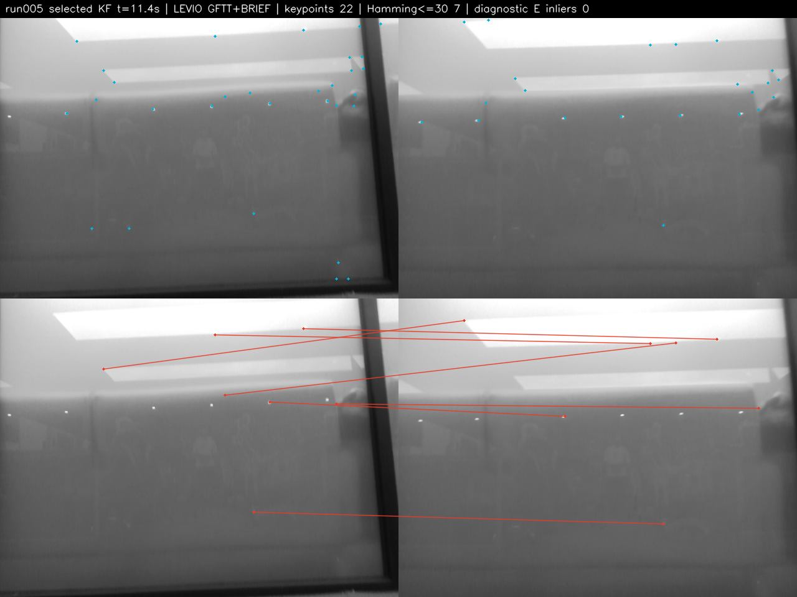
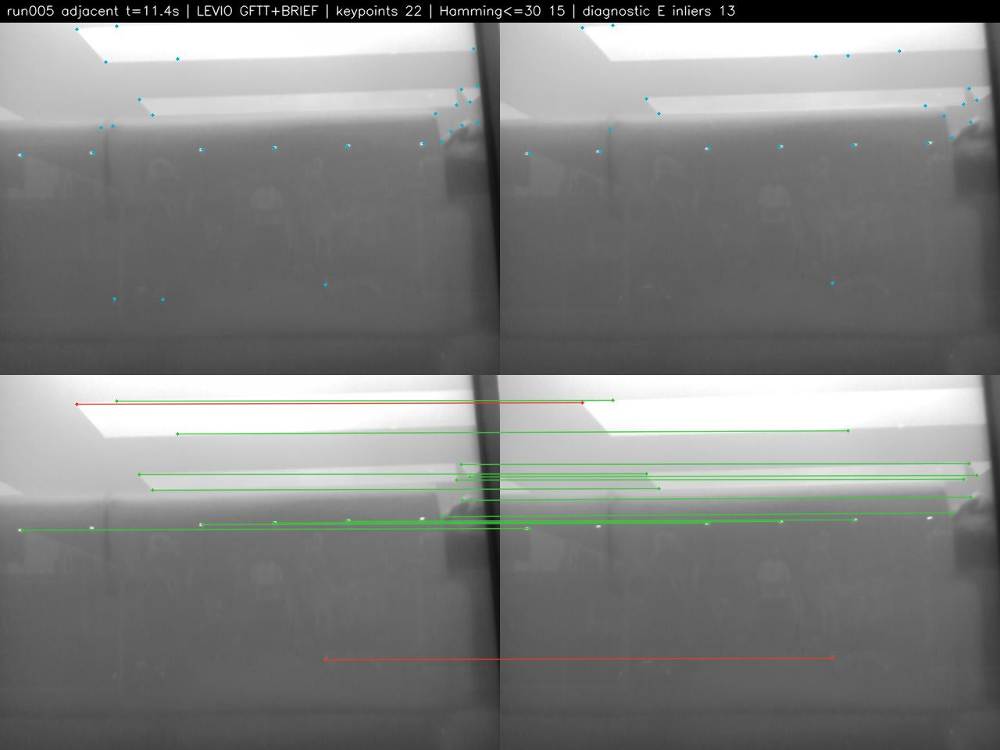
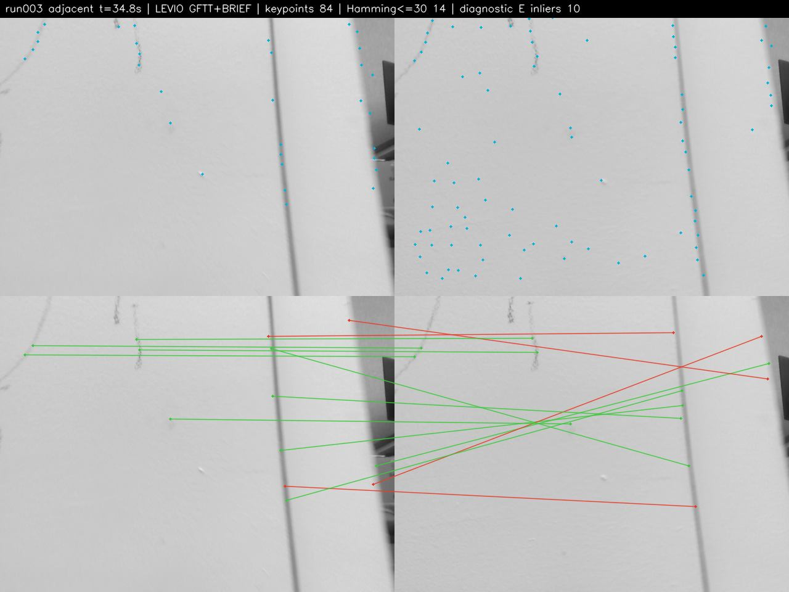
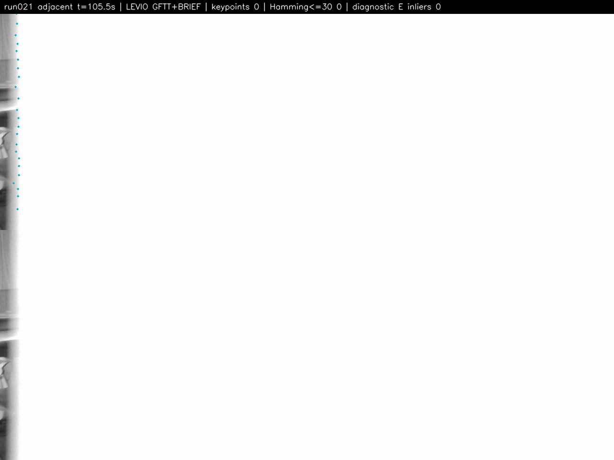
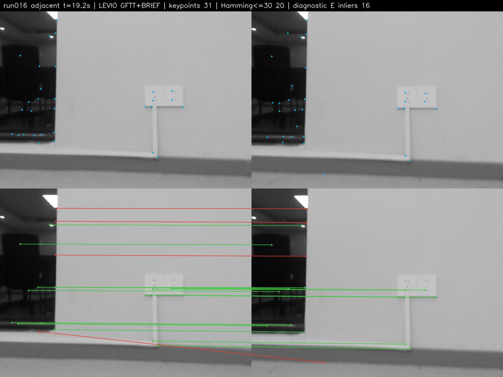
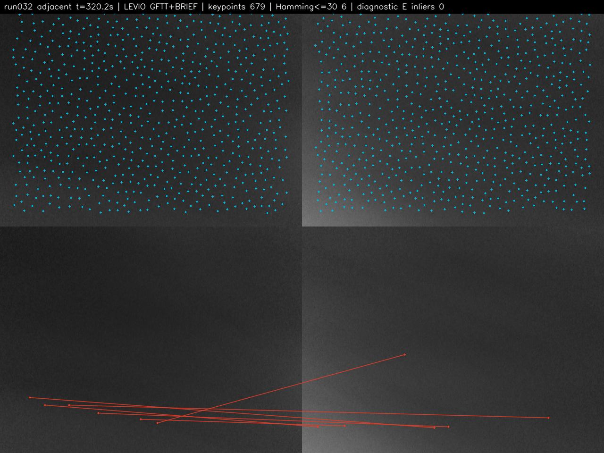
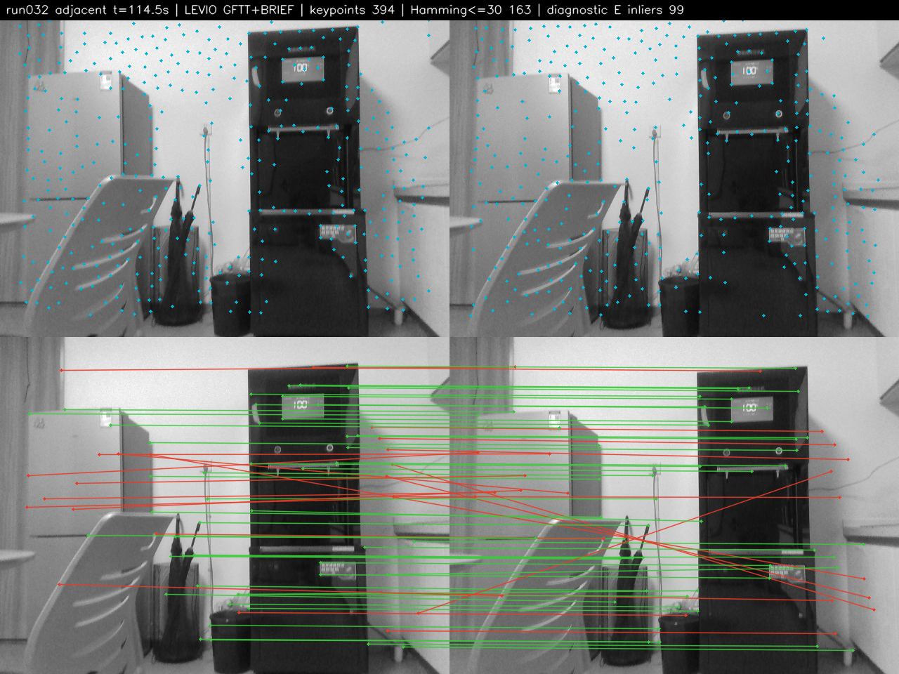

公开 Python 路径中，初始化前 `optimizer.previous_velocity` 仍为零，所选关键帧 ID 大于 5 时 E 相对平移用 `dt × ||previous_velocity||` 缩放。run005 前 180 帧共有 172 次 E 尝试，其中 117 次所选关键帧 ID 大于 5，且该段始终未初始化，因此这些成功的 E 位姿更新采用零平移尺度。run002/004/005/006/013/016/018 的初始化日志反复输出负尺度求解值，整段均未获得可确认的米制尺度。这一实现上的零速度反馈、较少的正深度点和运行时旧关键帧是相互关联的失效条件；当前实验不能把根本原因唯一归于其中一项。它们也解释了为何不能把未初始化的图形坐标直接当作米制位移。

`diagnose_init_time.py` 还直接比较**VIO 实际读取的第一张 RGB**与存储关键帧时间：run002/run005/run007 的真实首两关键帧间隔分别为 1.067/2.769/1.067 s，原 Python 的静止起飞捷径都把第一关键帧时间改写成距第二帧 0.5 s。对应已记录参考净位移分别约 0.684/0.407/0.042 m；EuRoC MH01 的首两关键帧间隔仅 0.25 s，未触发这项 0.5 s 改写。该捷径在不同运动条件下引入不同的 IMU 时间区间，是初始化敏感性的具体实现证据；只凭参考位移不能推断它是所有负尺度的唯一来源。

`run_ablations.sh` 固定原始 bag、相机和 IMU，仅改变所标记的单项，短窗口均从第一帧处理 300 帧；脚本同时把 run005 的相邻恢复两种模式跑完整段，避免只报告早期有利窗口。

| 控制变量 | 观测 | 可得结论 |
|---|---|---|
| run002 首帧相位 | 默认 300 帧不初始化；保留第一张原始 RGB 时间戳后在 frame179 初始化，但 300 帧路径比仍为 4.38。 | 取帧相位影响初始化，初始化本身不等于长程精度。 |
| run007 同 15 Hz 的 color/infra1 | 彩色在 frame52 初始化，红外 532 帧未初始化。 | 相机流和标定会改变本次初始化；不构成全局的 RGB 优于灰度结论。 |
| run007 完整段关闭图优化 | 默认 RMSE 2.274 m；关闭后 RMSE 7.375 m，预测路径近乎静止。 | 图优化对这段的在线平移输出至关重要；关闭优化不是“仅去掉 IMU”的对照。 |
| run010 600 帧同输入，开/关图优化 | 均在 frame345 初始化；随后 10 s 的首位姿 RMSE 分别 0.802/0.806 m。 | 这段早期误差不能单归因于图优化。 |
| run005 300 帧相邻恢复 | 默认未初始化；相邻恢复在 frame181 初始化。 | 它也使第二关键帧从 frame55 提前到 frame5，改变了初始化分支，不能单独归功于匹配时间更近。 |
| run005 完整段相邻恢复 | 初始化后 RMSE 53.088 m，路径比 253.74；相邻恢复+初始化前尺度变体 RMSE 78.126 m，路径比 105.23。 | 缩短 E 配对不能使完整轨迹可靠，不能作为已修复的默认模型。 |

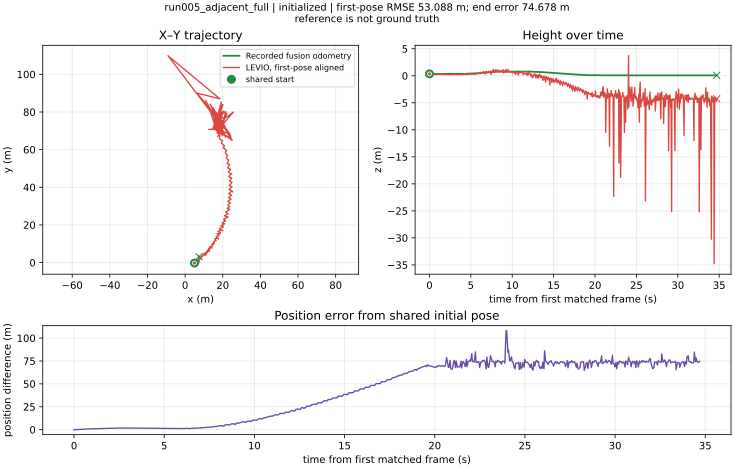
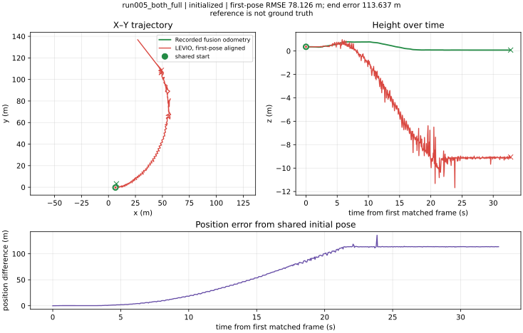

run005 的相邻恢复完整段在 frame659→660 出现约 43.8 m 的同帧图优化输出跳变，随后 frame661→662 的 PnP 输出又跳约 36.9 m；两次跳变来源不同。run011 默认完整回放在 frame2819→2820 发生 78.34 m 的预测单步，而同时间参考仅约 0.00003 m；该帧 PnP 失败后对 3.536 s 旧关键帧走 E 分支，状态含约 11.35 m/s 的既有速度，E 相对方向发生约 157.5° 翻转。run011 的失效不能只归咎于记录参考的跳变。run032 又提供另一种失效：评分窗内 frame2288→2289 的 PnP 输出跳 5.516 m/33.359 ms，同期参考只动约 0.0075 m；运行时有 163 个二维描述子匹配、选中的关键帧就是上一输入帧，当前帧没有图优化。原始 IMU 同窗口加速度模约 9.53–9.78 m/s²、角速度模约 0.13–0.17 rad/s。源码 PnP 分支在候选地图点达到 25 个后运行 RANSAC，但仅检查返回的内点列表非空，未设置返回内点数量门槛；163 个二维匹配也不等于有 163 个可靠三维地图点。当前没有记录该次 PnP 的三维内点数，因此能排除远关键帧、RGB 缺帧和参考跳变，却不能把突变唯一定位到 PnP、地图状态或此前优化中的某一个。

### 6.2 RGB 图像与邻帧特征的全段审计

在已纳入的 18 个 bag 上，逐一按 VIO 的 `capture_times.txt` 精确回读原始图像，合计检查实际送入估计器的 55,527 帧。定义“严重高亮”为灰度值 ≥250 的像素占全图 ≥80%；这是可复现的像素判据，不等于相机曝光元数据。只有 56/55,527 帧（0.101%）符合，分布于 3/18 段的 5 次短事件。表内首次 E 跳过来自同次 VIO 运行的 trace；“高亮重合”仅检查该帧是否满足上述判据。

| 序列 | VIO 帧数 | 严重高亮帧 | 高亮比例 | 每 5 s 角点/邻帧匹配中位数 | 首次 E 跳过帧 | 与严重高亮重合 |
|---|---:|---:|---:|---:|---:|---|
| run002 | 987 | 0 | 0.000% | 263.5/160 | 无 | — |
| run003 | 734 | 0 | 0.000% | 205.5/136 | 696 | 否 |
| run004 | 1582 | 0 | 0.000% | 226/135 | 1088 | 否 |
| run005 | 876 | 0 | 0.000% | 265/135 | 227 | 否 |
| run006 | 1717 | 0 | 0.000% | 228.5/153 | 无 | — |
| run007 | 709 | 0 | 0.000% | 201/139 | 无 | — |
| run009 | 246 | 0 | 0.000% | 490/193 | 无 | — |
| run010 | 2186 | 0 | 0.000% | 337.5/176 | 无 | — |
| run011 | 2822 | 0 | 0.000% | 257/146 | 无 | — |
| run013 | 3036 | 0 | 0.000% | 138/101.5 | 无 | — |
| run016 | 3592 | 20 | 0.557% | 123.5/70 | 384 | 否 |
| run018 | 4487 | 0 | 0.000% | 132/105 | 2677 | 否 |
| run020 | 5126 | 22 | 0.429% | 274/157 | 无 | — |
| run021 | 5976 | 14 | 0.234% | 315/161 | 2110 | 是 |
| run030 | 5192 | 0 | 0.000% | 226.5/114 | 807 | 否 |
| run032 | 6519 | 0 | 0.000% | 183/92 | 6403 | 否 |
| run034 | 4956 | 0 | 0.000% | 189/97 | 4418 | 否 |
| run036 | 4784 | 0 | 0.000% | 285.5/113 | 257 | 否 |

EuRoC MH01 对照：相同定义下 0/3682 帧严重高亮。在固定每 5 秒取一帧并和其前一 VIO 输入帧比较的 37 个样本中，GFTT+BRIEF 角点中位数 469，邻帧 Hamming≤30 匹配中位数 306。odom_dataset 的同法系统抽样共 563 帧，角点中位数 221、邻帧匹配中位数 120，只有 1 帧严重高亮、0 帧零角点，3 对邻帧匹配低于 8（均为 run016）。场景与段长不一致，这个数值差只表明这些输入上的前端约束显著不同，不能单独证明算法错误或曝光是主要原因。5 秒取样用于特征背景对照，不足以发现亚秒级闪白；严重高亮的出现率使用上述全帧统计。

run021 的唯一严重高亮事件覆盖 frame2108–2121，14 帧首末间隔 0.634 s；其中 8 帧全图灰度像素均 ≥250。首次 E 跳过的 frame2110 的原始 `rgb8` 三通道每个像素均 ≥250，三通道中位数为 [252, 255, 255]，转灰度后全图为 254；D=0 去畸变前后逐像素一致，全部 1346 个抽样/失效邻域图像也均逐像素不变。该帧与前一个实际 VIO 输入间隔 66.7 ms，GFTT+BRIEF 角点和邻帧匹配均为 0。frame2122 的高亮比例降至 78.5%，frame2130 降至 2.2%。因此该图对应**已记录的短时近饱和恒值白帧**，没有证据表明是 RGB 消息缺失、RGB→灰度/去畸变或拼图程序造成；仅凭像素不能判定相机自动曝光、直视光源或其他成像原因。

run016 有两次严重高亮事件（13 帧/0.600 s 与 7 帧/0.300 s），run020 有两次（7 帧/0.300 s 与 15 帧/0.701 s）；run016 首次 E 跳过 frame384 发生于首次高亮 frame495 之前，run020 全程没有 E 跳过。其它有首次 E 跳过的段中，该帧均未达到严重高亮阈值。run032 首次 E 跳过 frame6403 灰度均值 55.0、标准差 12.4，保有 679 个角点、覆盖 48/48 个网格，但 66.7 ms 邻帧只有 6 个 Hamming≤30 匹配；这是暗且低对比度画面中特征**数量与可匹配性脱节**的例子，不能仅用角点数判断视觉约束是否有效，也不能把它归因于白屏。

复现命令（在仓库根目录、已有 Docker 镜像及本报告列出的 bag/EuRoC 运行结果上执行）：

```bash
docker run --rm --user "$(id -u):$(id -g)" -v "$PWD:/workspace/levio" \
  levio-research:py310 python research/audit_image_quality.py
docker run --rm --user "$(id -u):$(id -g)" -v "$PWD:/workspace/levio" \
  levio-research:py310 python research/audit_image_quality.py --dense-all
```

定量结果写入忽略提交的 `research_results/image_quality/`；可提交的局部时间线为 `research/figures/run021_exposure_timeline.svg`。逐帧扫描覆盖 VIO 实际选取的 20 Hz 输入，不声称其它未取用的约 30 Hz 原始图像均无异常；像素判据也无法检验曝光时刻与 IMU 的物理固定时偏。

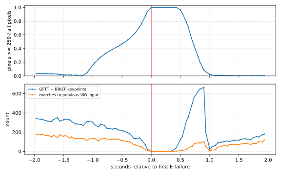

### 6.3 初始运动、参考高度与时间戳

`audit_startup_dynamics.py` 从同一批原始 bag 的参考里程计、raw IMU、相机采集时间和已保存的关键帧计算下表。前 5 s 路程和 `world` z 差都相对第一张**实际送入 VIO**的 RGB；它们不是飞机相对于地面的真实高度或独立真值。首两关键帧“实际”间隔来自原始相机头时间，“存储”间隔来自 LEVIO 输出。

| 序列 | 首 5 s 参考路程 m | 首 5 s `world` Δz m | 首 2 s 陀螺 p95 rad/s | 首两关键帧实际/存储间隔 s | 初始化距首 RGB s |
|---|---:|---:|---:|---:|---:|
| run002 | 4.481 | +0.005 | 0.197 | 1.067/0.500 | — |
| run003 | 2.582 | +0.004 | 0.137 | 1.368/0.500 | 8.5 |
| run004 | 1.366 | +0.026 | 0.225 | 3.970/0.500 | — |
| run005 | 1.787 | -0.002 | 0.117 | 2.769/0.500 | — |
| run006 | 3.409 | +0.017 | 0.234 | 1.000/0.500 | — |
| run007 | 1.591 | -0.053 | 0.157 | 1.067/0.500 | 3.3 |
| run009 | 0.126 | +0.000 | 0.007 | 6.677/0.500 | 7.5 |
| run010 | 0.041 | +0.001 | 0.006 | 8.173/0.500 | 17.3 |
| run011 | 0.080 | -0.006 | 0.006 | 6.804/0.500 | 15.6 |
| run013 | 0.092 | -0.002 | 0.010 | 11.124/0.500 | — |
| run016 | 0.059 | +0.000 | 0.006 | 5.269/0.500 | — |
| run018 | 0.064 | -0.001 | 0.005 | 14.967/0.500 | — |
| run020 | 0.048 | +0.000 | 0.005 | 10.607/0.500 | 22.0 |
| run021 | 0.096 | -0.001 | 0.005 | 5.926/0.500 | 13.6 |
| run030 | 0.135 | +0.004 | 0.013 | 5.103/0.500 | 13.2 |
| run032 | 0.130 | -0.003 | 0.009 | 3.969/0.500 | 14.3 |
| run034 | 0.079 | +0.002 | 0.006 | 3.703/0.500 | 8.2 |
| run036 | 0.088 | -0.004 | 0.006 | 4.403/0.500 | 20.3 |

run002–run007 录制起始 5 s 的参考路程为 1.37–4.48 m，首 2 s 陀螺模长 p95 为 0.117–0.234 rad/s，其中 2/6 段初始化；其余 12 段分别为 0.041–0.135 m 和不超过 0.013 rad/s，其中 9/12 段初始化。这是**起始运动与成功初始化的相关性**，同时混有场景、录制日期和时长差异，不能识别单一因果。EuRoC MH01 的独立真值从首 RGB 后 1.075 s 才开始；从真值首时刻计的前 5 s 路程为 2.446 m，首 RGB 后 2 s 陀螺 p95 为 0.409 rad/s，仍在 1.55 s 初始化。因此“开始运动”本身也不是普遍致命条件。

公开 Python 的“静止起飞”捷径在第二关键帧 ID 大于 10 时，把第一关键帧时间写成第二关键帧前 0.5 s，并在相应初始化分支作零速度假设。本批 **18/18 段**都触发；原始首两关键帧间隔其实为 1.000–14.967 s。EuRoC MH01 原始与存储间隔均为 0.250 s，没有触发。该时间改写使 IMU 积分窗口与真实图像间隔不一致，尤其对已经运动的开头值得怀疑；下节用保留原时间戳的完整重放量化其效果。

多数由静止开头并成功初始化的序列，在初始化时的记录 `world` z 比首 RGB 大约高 0.29–0.45 m；但未初始化的 run013、run016、run018 在录制后段也分别达到相对首帧 +0.398、+0.345、+1.503 m。**现有数据不能把这些变化换算成起飞离地高度**：18 段都有深度图，16 段有 ToF 阵列话题，但所附 [ToF 标定文件](research/calibration/tof_to_base.yaml)声明固定 ToF→机体外参不可用，也没有已标注的地面平面；融合里程计自身并非独立真值。单目 VIO 本次只读取 RGB 与飞控 raw IMU，不使用深度或 ToF 高度。

在裁到 RGB、IMU、参考共同区间后的原始 RGB 中，最近 raw IMU 消息头时间差 p99 逐段为 2.999–5.932 ms、最大值逐段为 3.435–32.474 ms，支持记录时间轴覆盖但不测量曝光时刻的物理零偏。以 run007 为例，`header.stamp−bag 写入时刻` 的中位数在 RGB/raw IMU/参考话题分别为 −38.3/−0.9/−212.7 ms；这是各话题发布与写包链路的时差，**不能把 RGB 的约 38 ms 直接用作相机—IMU 校正量**。run018 的[元数据](research/metadata/run018/metadata.yaml)注明设备绝对时钟未同步；本报告仅使用同一 bag 内连续的相对时间，不能据此推断真实日期或跨设备硬件零偏。

### 6.4 仅用已有数据的受控适配

以下试验都在相同已校验 bag、相同相机、raw IMU、20 Hz 图像选择和记录里程计上运行。`run_startup_sensitivity.sh` 仅保留第一关键帧的真实时间戳，仍保留首次 E 平移使用 0.5 s 和“静止起飞”零初速分支；`run_input_adaptation.sh` 分别在灰度图进入原前端前使用 CLAHE（clip 2.0、8×8）和只向 VIO 传入的相机时间加 ±15 ms。三种处理都是**显式可选变体**；默认运行、EuRoC 上游对照和18段主表未改变。脚本只检查已有 bag，不下载数据。

比较器 `compare_input_variants.py` 验证两次运行使用逐张相同的 `capture_times.txt`，评分从双方均已初始化的较晚帧开始，并在任一方首次 E 跳过前结束。每个预测轨迹只以该共窗首位姿固定一次 SE(3) 对齐到相同参考首位姿，起点误差被断言为零；无整段最优拟合或尺度修正。若一方未初始化，就不伪造可比的米制分数。

| 保留首关键帧真实时间 | 默认结果 | 变体结果 | 共窗判读 |
|---|---|---|---|
| run002 | 全段 987 帧未初始化 | frame179 初始化；其后 808 帧/40.33 s 的 RMSE 0.574 m、路径长比 2.457 | 默认无米制窗；改写确实影响初始化，但路径明显过长。 |
| run005 | 未初始化，首次 E 跳过 frame227 | frame173 初始化，但 frame227 已 E 跳过；有效窗仅 54 帧/2.64 s，RMSE 0.592 m | 不能把 2.64 s 局部数值当作全段成功。 |
| run007 | 共窗 frame69–708：RMSE 2.339 m、路径比 3.103 | 同 640 帧：RMSE 2.732 m、路径比 4.243 | 原时间戳在相同窗变差。 |
| run010 | 共窗 1841 帧：RMSE 2.353 m、路径比 0.767 | 同窗 RMSE 1.770 m、路径比 1.998 | 位置 RMSE 降低，但预测路径近参考两倍，不能只用单项判定修复。 |
| run034 | 共窗 4254 帧：RMSE 9784 m | 同窗 RMSE 10554 m | 两者均数值发散。 |

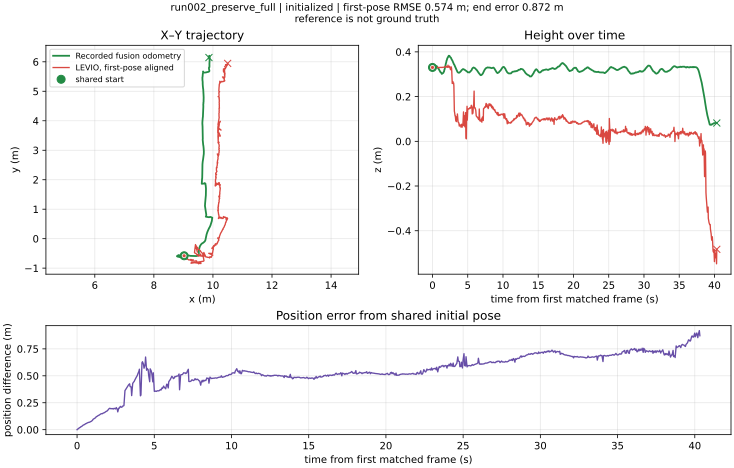
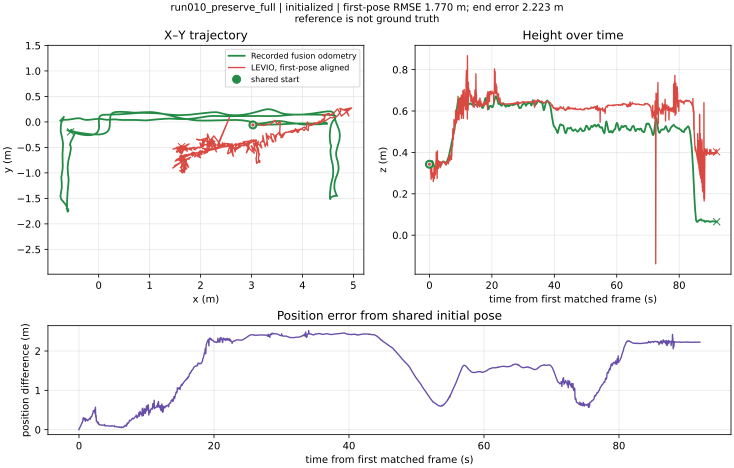

| 图像/时间输入变体 | 同输入完整回放与公平共窗观察 |
|---|---|
| run005 CLAHE | 角点与相邻匹配在失效 frame227 从 22/15 提至 148/51，但完整 876 帧仍未初始化。 |
| run007 CLAHE | 初始化从 frame65 延至 frame222；同一 frame222–708 的 487 帧/24.317 s 窗口，RMSE 2.937→2.722 m，端点 3.421→3.250 m，路径比 3.481→1.144。只说明该段共窗改善。 |
| run021 CLAHE | 原始 frame2110 灰度全图恒 254，处理前后均零角点；完整 5976 帧由默认 frame271 初始化变为整段未初始化，首次 E 跳过 frame2109。 |
| run032 单帧 CLAHE 诊断 | 首次 E 失败帧邻帧匹配从 6 降至 3；简单增亮不能保证稳定匹配。 |
| run007 相机时间 ±15 ms | 三次同为 frame65–708 的 644 帧/32.156 s；首位姿 RMSE 在 0/−15/+15 ms 分别为 2.274/2.781/2.556 m，两个偏移均更差。 |

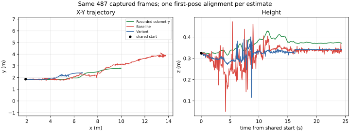

定量上，CLAHE 在个别帧改善匹配并在 run007 的共同窗口改善位置和路径长指标，但不能恢复已录为恒值的图像，也不能修复所有初始化。±15 ms 试验仅是单段灵敏度分析，不证明真实时偏为零，更不能排除其它段或更复杂的时间漂移。保留真实首关键帧时间影响部分序列，但 run034 的发散、run032 的弱匹配和 run021 的恒值白帧属于不同机制；当前没有一个可复现的统一参数同时修复这些现象。

## 7. 18 段结果与逐段解读

### 7.1 完整回放与起点固定的连续前缀评分

正式清单的 18 段均已通过完整 bag 的 RGB、飞控 raw IMU 和参考话题时间轴审计，Docker 回放也均结束。表中 `complete` 只表示回放输出完整，**不**表示 VIO 已初始化或位姿准确。7 段未初始化；run036 虽在 frame406 初始化，却在 frame257 已首次跳过本质矩阵更新，因而没有满足预定规则的初始化后连续评分窗。其余 10 段有米制评分，其中 run009 的参考里程计在仅 4.7 s 的评分窗内跳变 2.446 m；run011、run020 的评分窗也各有一次米级参考跳变。表中保留这些原始全段数值并在分窗汇总中标记受影响窗口，不能把受污染数值当作精度声明。

<!-- GENERATED COHORT START -->

已列入默认 cohort：18/18 段；时间轴审计通过 18 段；完整结果 18 段；两项均满足 18 段。

| Bag | RGB 帧 | 最大 RGB 间隔 (ms) | raw IMU 条数 | 最大 IMU 间隔 (ms) | RGB–最近 IMU 最大差 (ms) | 参考 >1 m 单步 | 时间轴审计 |
|---|---:|---:|---:|---:|---:|---:|---|
| run002 | 1487 | 33.7 | 9913 | 10.0 | 3.5 | 0 | pass |
| run003 | 1107 | 33.6 | 7386 | 7.5 | 3.4 | 0 | pass |
| run004 | 2378 | 33.7 | 15846 | 22.0 | 6.5 | 0 | pass |
| run005 | 1321 | 33.7 | 8795 | 24.6 | 3.5 | 0 | pass |
| run006 | 2581 | 33.7 | 17196 | 8.0 | 3.7 | 0 | pass |
| run007 | 1071 | 33.4 | 7111 | 26.1 | 10.5 | 0 | pass |
| run009 | 376 | 33.7 | 2489 | 71.3 | 26.0 | 1 | pass |
| run010 | 3283 | 33.7 | 21876 | 64.1 | 32.0 | 0 | pass |
| run011 | 4237 | 33.6 | 28221 | 63.6 | 15.4 | 1 | pass |
| run013 | 4557 | 33.7 | 30368 | 64.6 | 19.4 | 0 | pass |
| run016 | 5390 | 33.7 | 35923 | 59.7 | 27.2 | 0 | pass |
| run018 | 6733 | 33.8 | 44853 | 74.4 | 32.5 | 0 | pass |
| run020 | 7692 | 33.8 | 51249 | 59.6 | 28.5 | 1 | pass |
| run021 | 8965 | 33.7 | 59745 | 70.4 | 29.4 | 1 | pass |
| run030 | 7789 | 33.7 | 51926 | 63.2 | 27.2 | 0 | pass |
| run032 | 9778 | 33.8 | 65171 | 57.6 | 13.2 | 1 | pass |
| run034 | 7436 | 33.8 | 49553 | 62.6 | 17.4 | 1 | pass |
| run036 | 7178 | 33.7 | 47850 | 68.4 | 23.2 | 1 | pass |

| Bag | 处理帧 | 初始化帧 | 评分帧 | 评分跨度 (s) | 首位姿 RMSE (m) | 端点差 (m) | EDR (%) | 路径比 | 最大预测单步 (m) | 最大参考单步 (m) | >1 m 步数（预测/参考） | 结果 |
|---|---:|---:|---:|---:|---:|---:|---:|---:|---:|---:|---:|---|
| run002 | 987 | — | — | — | — | — | — | — | — | — | — | complete |
| run003 | 734 | 170 | 526 | 26.3 | 4.275 | 8.286 | 66.0 | 0.74 | 0.194 | 0.071 | 0/0 | complete |
| run004 | 1582 | — | — | — | — | — | — | — | — | — | — | complete |
| run005 | 876 | — | — | — | — | — | — | — | — | — | — | complete |
| run006 | 1717 | — | — | — | — | — | — | — | — | — | — | complete |
| run007 | 709 | 65 | 644 | 32.2 | 2.274 | 2.988 | 25.4 | 3.09 | 0.690 | 0.061 | 0/0 | complete |
| run009 | 246 | 150 | 96 | 4.7 | 0.852 | 0.489 | 8.9 | 0.77 | 0.266 | 2.446 | 0/1 | complete |
| run010 | 2186 | 345 | 1841 | 92.0 | 2.353 | 3.350 | 12.4 | 0.77 | 0.229 | 0.056 | 0/0 | complete |
| run011 | 2822 | 311 | 2511 | 125.5 | 11.658 | 81.455 | 152.8 | 45.80 | 78.342 | 3.167 | 114/1 | complete |
| run013 | 3036 | — | — | — | — | — | — | — | — | — | — | complete |
| run016 | 3592 | — | — | — | — | — | — | — | — | — | — | complete |
| run018 | 4487 | — | — | — | — | — | — | — | — | — | — | complete |
| run020 | 5126 | 440 | 4686 | 234.2 | 6.188 | 11.525 | 15.5 | 7.44 | 8.716 | 3.192 | 131/1 | complete |
| run021 | 5976 | 271 | 1839 | 91.9 | 2.111 | 2.190 | 8.3 | 3.43 | 0.698 | 0.066 | 0/0 | complete |
| run030 | 5192 | 264 | 543 | 27.1 | 1.796 | 3.965 | 32.6 | 0.49 | 0.110 | 0.074 | 0/0 | complete |
| run032 | 6519 | 285 | 6118 | 305.8 | 5.226 | 11.243 | 10.7 | 4.34 | 5.516 | 0.066 | 55/0 | complete |
| run034 | 4956 | 164 | 4254 | 212.7 | 9784.256 | 18573.219 | 20882.7 | 1705.63 | 2168.976 | 0.069 | 3943/0 | complete |
| run036 | 4784 | 406 | — | — | — | — | — | — | — | — | — | complete |

<!-- GENERATED COHORT END -->

### 7.2 等时长和等路程分析

原始 RGB、IMU、参考共同记录长度为 **12.3–325.9 s**，初始化后且首次 E 更新失败前的可评分长度只有 **4.7–305.8 s**。因此从不同长度的连续前缀 RMSE 直接排序会混入观测时长差异。分窗脚本对所有段统一采用非重叠的 **10 s、30 s** 时间窗，另按 [TIO-Former 测试序列 4–7 m 的尺度](https://arxiv.org/html/2609.17198)设 **5 m 参考路程窗**。5 m 是本研究的独立分析选择，并非复刻该论文的数据划分。时间窗要求首尾各距窗口边界不超过 80 ms；不足一个完整窗口的尾段不进入该等长统计。5 m 窗口使用参考路径选择边界，故只用于离线评价，不影响在线估计。每个窗口均使用**该窗口第一对相机位姿**确定一次 SE(3) 转换，平移和朝向起点同时重合；其余位姿没有用于对齐，也没有尺度拟合。估计器在分窗边界**不重新初始化**，这些数字表示同一在线状态在局部窗口内的增量漂移，不能代替全程开放环累计偏差。

<!-- GENERATED SEGMENTS START -->

| Bag | 原始共同时间 (s) | 处理帧 | 可评分时间 (s) | 10 s 完整/参考合格窗 | 10 s 合格窗 RMSE 中位/最大 (m) | 30 s 完整/参考合格窗 | 30 s 合格窗 RMSE 中位/最大 (m) |
|---|---:|---:|---:|---:|---:|---:|---:|
| MH01_euroc_full | — | 3682 | 181.5 | 18/16 | 0.342/2.531 | 6/6 | 0.796/1.927 |
| run002 | 49.4 | 987 | — | 0/0 | —/— | 0/0 | —/— |
| run003 | 36.7 | 734 | 26.3 | 2/2 | 1.581/2.397 | 0/0 | —/— |
| run004 | 79.1 | 1582 | — | 0/0 | —/— | 0/0 | —/— |
| run005 | 43.8 | 876 | — | 0/0 | —/— | 0/0 | —/— |
| run006 | 85.8 | 1717 | — | 0/0 | —/— | 0/0 | —/— |
| run007 | 35.5 | 709 | 32.2 | 3/3 | 0.689/2.902 | 1/1 | 2.211/2.211 |
| run009 | 12.3 | 246 | 4.7 | 0/0 | —/— | 0/0 | —/— |
| run010 | 109.3 | 2186 | 92.0 | 9/9 | 0.966/2.274 | 3/3 | 2.220/2.893 |
| run011 | 141.1 | 2822 | 125.5 | 12/11 | 1.203/6.622 | 4/3 | 2.027/8.462 |
| run013 | 151.8 | 3036 | — | 0/0 | —/— | 0/0 | —/— |
| run016 | 179.6 | 3592 | — | 0/0 | —/— | 0/0 | —/— |
| run018 | 224.4 | 4487 | — | 0/0 | —/— | 0/0 | —/— |
| run020 | 256.3 | 5126 | 234.2 | 23/22 | 0.942/5.322 | 7/7 | 2.301/5.411 |
| run021 | 298.8 | 5976 | 91.9 | 9/9 | 0.366/2.373 | 3/3 | 1.711/2.453 |
| run030 | 259.6 | 5192 | 27.1 | 2/2 | 0.926/0.950 | 0/0 | —/— |
| run032 | 325.9 | 6519 | 305.8 | 30/30 | 1.026/5.434 | 10/10 | 1.571/3.662 |
| run034 | 247.8 | 4956 | 212.7 | 21/21 | 588.486/1541.991 | 7/7 | 1590.218/3837.702 |
| run036 | 239.2 | 4784 | — | 0/0 | —/— | 0/0 | —/— |

| Bag | 5 m 完整/参考合格窗 | 合格窗时长中位数 (s) | 合格窗 RMSE 中位/最大 (m) |
|---|---:|---:|---:|
| MH01_euroc_full | 16/16 | 9.3 | 0.370/1.966 |
| run002 | 0/0 | — | —/— |
| run003 | 2/2 | 11.2 | 1.911/2.105 |
| run004 | 0/0 | — | —/— |
| run005 | 0/0 | — | —/— |
| run006 | 0/0 | — | —/— |
| run007 | 2/2 | 8.9 | 1.558/2.397 |
| run009 | 1/0 | — | —/— |
| run010 | 5/5 | 14.9 | 1.350/1.965 |
| run011 | 10/9 | 11.2 | 1.318/6.525 |
| run013 | 0/0 | — | —/— |
| run016 | 0/0 | — | —/— |
| run018 | 0/0 | — | —/— |
| run020 | 14/14 | 15.0 | 1.543/5.021 |
| run021 | 5/5 | 15.5 | 0.658/2.566 |
| run030 | 2/2 | 12.4 | 1.054/1.168 |
| run032 | 20/20 | 14.3 | 1.021/3.046 |
| run034 | 17/17 | 11.0 | 732.725/1886.560 |
| run036 | 0/0 | — | —/— |

参考异常窗口（包括从合格窗汇总中排除的窗口）：

- MH01_euroc_full, 10, 窗口 2: reference path < 0.25 m.
- MH01_euroc_full, 10, 窗口 3: reference path < 0.25 m.
- run011, 10, 窗口 11: reference step > 1 m.
- run011, 30, 窗口 3: reference step > 1 m.
- run020, 10, 窗口 22: reference step > 1 m.
- run009, 5 m, 窗口 0: reference step > 1 m.
- run011, 5 m, 窗口 9: reference step > 1 m.

<!-- GENERATED SEGMENTS END -->

在共 **264** 个完整窗口的三类评价记录中，预测与参考的首位姿位置误差均为 **0 m**。参考相邻单步超过 1 m 的窗口或参考全窗路程小于 0.25 m 的时间窗单列，不参与“参考合格窗”中位数；估计轨迹的大跳变则**不会**被这个筛选排除。EuRoC 的两段 10 s 窗因参考路程过短而标记；run009 的唯一 5 m 窗因参考跳变被标记。TIO-Former 以独立动捕真值评价 4–7 m 的保留测试序列，表中的 odom_dataset 仍用来源未证实的记录里程计，且 LEVIO 输入是 RGB+飞控 IMU、TIO-Former 是 ToF+IMU。因此相同路程窗只改善本报告内部的长度可比性，**不能**拿两篇工作或两个数据集的 RMSE/EDR 作同协议排名。

起点共位的窗口示例：

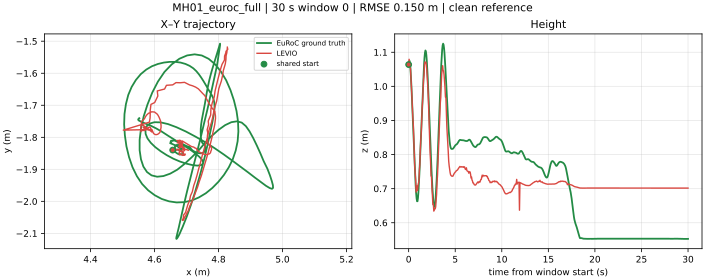
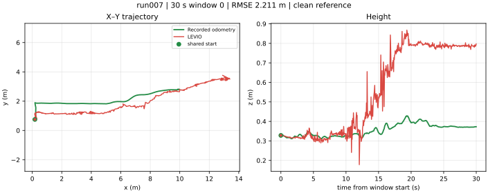
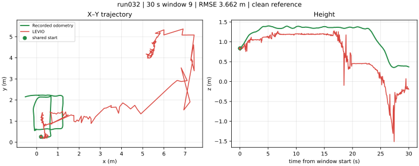
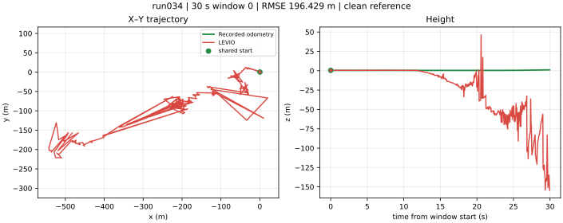

EuRoC MH01 在相同代码输出上，10 s 参考合格窗的 RMSE 中位数为 **0.342 m**，30 s 为 **0.796 m**，5 m 路程窗为 **0.370 m**；初始化后全段首位姿固定 RMSE 却为 **4.406 m**。短窗口确实能避免把长时累积漂移全部归给局部跟踪，但它也会显著降低被报告的误差。因此以下同时保留整段与分窗，不选择单一较好数字作结论。

### 7.3 各段图与判读

有米制评分的叠绘图，其绿色、红色起点重合；未获得有效米制评分的图改画特征匹配与关键帧年龄，标题明确标为无有效米制轨迹。以下引用的连续前缀指标以 7.1 表为准，局部分窗以 7.2 表为准。

<details><summary>run002：49.4 s，未初始化</summary>

RGB/IMU 时间轴完整；运行时 975 次 E 尝试、11 次被模型接受的 PnP，且没有 E 跳过，仍未完成初始化。它说明“过旧关键帧”或缺帧并不是所有未初始化段的必要条件。未定义米制 RMSE。


</details>

<details><summary>run003：26.3 s 可评分</summary>

frame170 初始化；首次 E 跳过前的首位姿 RMSE 为 4.275 m、端点差 8.286 m。frame696 首次失败时选中关键帧距当前约 100 ms、只有 7 个匹配；相邻输入帧距当前约 67 ms、有 14 个匹配。2 个完整 10 s 窗的 RMSE 中位数为 1.581 m；局部重新固定起点后误差较低，与累计漂移一致，但未覆盖最后约 6.3 s。


</details>

<details><summary>run004：79.1 s，未初始化</summary>

虽然 RGB 序号及时间连续，运行时 E 对的最长时差达 23.179 s，364 次超过 5 s；这是估计器选旧关键帧的行为，不能解释成原始 RGB 缺失。保护性跳过 E 共 9 次，未得到米制评分。

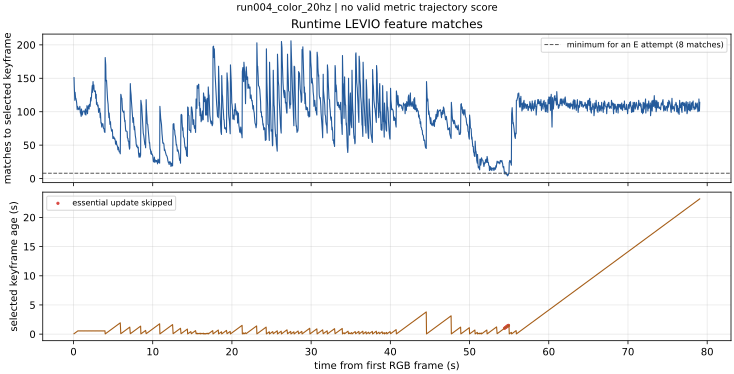
</details>

<details><summary>run005：43.8 s，未初始化</summary>

原 `main` 在 frame201 因空地图描述子传给匹配器而中止，但同帧图像仍有 83 个特征；研究分支保护后完整运行。首个 E 跳过在 frame227，选中关键帧仅 7 个匹配，相邻输入帧有 15 个。最长 E 配对时差 10.604 s。相邻帧恢复消融虽然能初始化，完整段却出现数十米跳变，不能把短窗口成功当成修复。


</details>

<details><summary>run006：85.8 s，未初始化</summary>

RGB/IMU 输入完整，E 分支没有跳过，最长 E 配对时差 3.803 s，且运行时有 91 次被模型接受的 PnP；仍无初始化后的米制轨迹。故不能把全部失败归为低匹配保护或单个离得很远的关键帧。

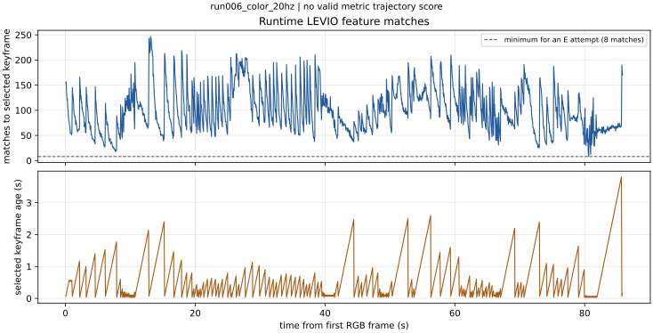
</details>

<details><summary>run007：32.2 s 可评分</summary>

frame65 初始化、无 E 跳过；原 `main` 与研究分支的三种 TUM 输出在全 709 帧逐字节一致。连续前缀首位姿 RMSE 2.274 m，30 s 窗 RMSE 2.211 m；3 个 10 s 窗中位数 0.689 m。预测路程是参考的 3.09 倍，可能同时受尺度误差和轨迹抖动影响。


</details>

<details><summary>run009：仅 4.7 s 可评分</summary>

原始共同记录 12.3 s，frame150 才初始化，故没有完整的 10 s/30 s 窗。评分窗内参考里程计发生 2.446 m 单步跳变，唯一 5 m 窗因此不合格；全段 RMSE 0.852 m 与 EDR 8.9% 不能作为可靠长程精度证据。


</details>

<details><summary>run010：92.0 s 可评分</summary>

frame345 初始化、无 E 跳过；评分窗内参考最大相邻步仅 0.056 m。全段首位姿 RMSE 2.353 m、EDR 12.4%，9 个 10 s 参考合格窗 RMSE 中位数 0.966 m，说明局部误差低于全段累计误差，但仍有米级漂移。


</details>

<details><summary>run011：125.5 s 可评分，末段估计突变</summary>

评分窗内参考有 3.167 m 单步跳变，应剔除含该步的局部窗；估计器另在 frame2819→2820 输出 78.342 m 单步，同期参考仅约 0.00003 m。该帧 PnP 失败后与 3.536 s 旧关键帧走 E 分支。11 个参考合格的 10 s 窗 RMSE 中位数 1.203 m，但全段 RMSE 11.658 m，突变不能只归因于参考跳变。

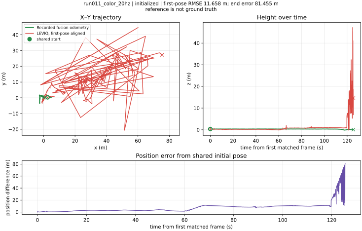
</details>

<details><summary>run013：151.8 s，未初始化</summary>

原始 RGB/IMU 时间轴完整，运行时 2965 次 E 尝试、70 次被模型接受的 PnP，没有 E 跳过，仍未初始化；不能定义米制误差。

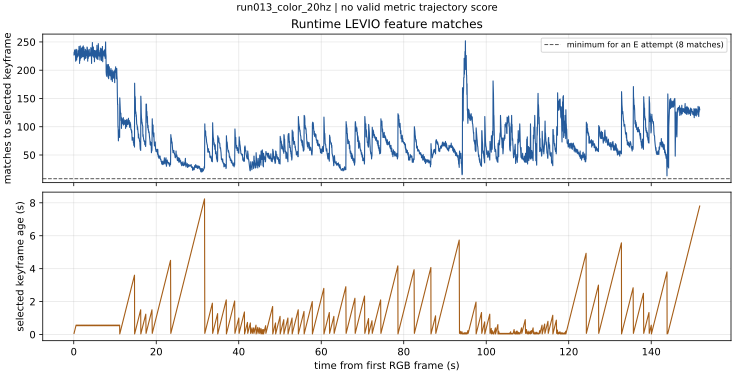
</details>

<details><summary>run016：179.6 s，未初始化</summary>

首次 E 跳过在 frame384：选中关键帧距当前约 0.5 s、有 7 个匹配，相邻输入帧约 33 ms、有 20 个匹配。其后失效反馈导致 E 配对最长达 99.137 s，不能拿这些远时差配对判断相邻 RGB 是否缺帧。全段没有米制评分。

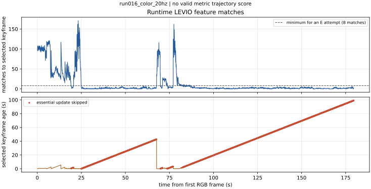

</details>

<details><summary>run018：224.4 s，未初始化</summary>

session 名带 1970 年时间，但 bag 内 RGB/IMU/参考的相对 ROS 时间轴一致；其最大 RGB 间隔 33.8 ms、IMU 间隔 74.4 ms。运行时 4486 次 E 尝试、零次被接受的 PnP，未获得可评分轨迹。可疑 session 名不能代替时间轴审计。

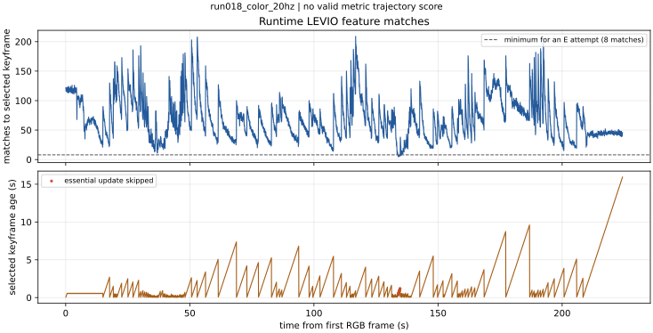
</details>

<details><summary>run020：234.2 s 可评分，参考与估计均有跳变</summary>

全段首位姿 RMSE 6.188 m，预测最大单步 8.716 m；评分窗中的参考也有 3.192 m 单步。23 个完整 10 s 窗中 22 个参考合格，合格窗 RMSE 中位数 0.942 m；7 个完整 30 s 窗均参考合格，中位数 2.301 m。分窗显示常态局部误差与整段跳变并存，不能只报告中位数。

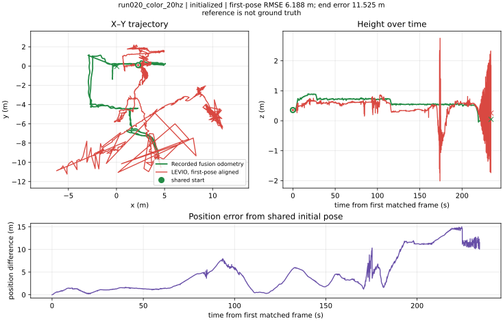
</details>

<details><summary>run021：91.9 s 可评分</summary>

原始共同记录 298.8 s，但 frame2110 首次 E 跳过后停止米制评分；该相邻输入帧已记录为近饱和恒值白帧，当前帧特征数为零。评分窗 RMSE 2.111 m、9 个 10 s 合格窗中位数 0.366 m。原始 bag 后段参考有 2.331 m 跳变，发生在评分窗外，不能用它解释评分窗误差。

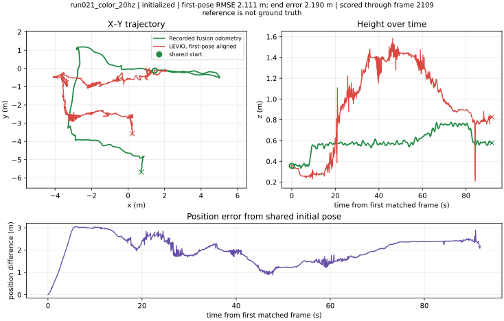

</details>

<details><summary>run030：仅 27.1 s 可评分</summary>

原始共同记录 259.6 s，但 frame807 首次 E 跳过；相邻输入帧约 33 ms、仅 4 个匹配，未见“只因远关键帧”的证据。全段可评分前缀 RMSE 1.796 m；只有 2 个完整 10 s 窗，没有完整 30 s 窗，不能把 259.6 s 当作有效持续跟踪长度。

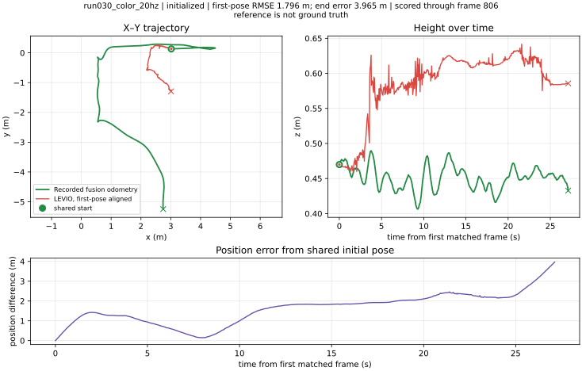
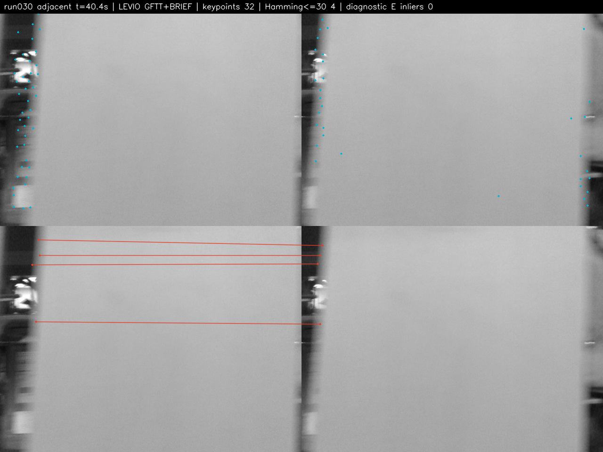
</details>

<details><summary>run032：305.8 s 可评分，PnP 大步</summary>

全段首位姿 RMSE 5.226 m、路径比 4.34；30 个 10 s 合格窗 RMSE 中位数 1.026 m。frame2288→2289 在约 33 ms 内预测跳 5.516 m，参考仅移动约 0.0075 m；运行时 PnP 被模型接受、选中关键帧是上一输入帧。该异常不能归于远关键帧或参考跳变；PnP 三维内点数未被记录，故不能进一步唯一定位到哪一个内部状态。

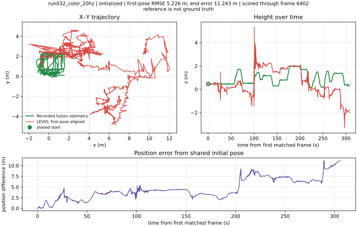

</details>

<details><summary>run034：212.7 s 可评分，但严重数值发散</summary>

frame164 初始化后约 5.915 s 误差超过 1 m、约 20.308 s 超过 100 m；首位姿 RMSE 9784.256 m、端点差 18573.219 m，21 个 10 s 合格窗 RMSE 中位数仍达 588.486 m。frame4084 的 PnP 被模型接受，当步预测 2168.976 m，同期参考仅 0.0193 m。评分窗内参考最大相邻步 0.0695 m；原始参考 1.400 m 跳变在评分终点约 24 s 后，不能解释此发散。短窗口也不能使其成为正常精度。

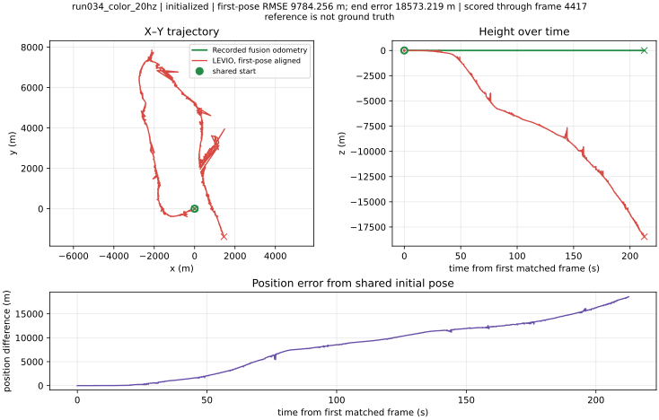
</details>

<details><summary>run036：初始化在失效之后，无有效米制窗</summary>

原始共同记录 239.2 s；frame257 首次 E 跳过，frame406 才初始化。首次失败处选中关键帧约 0.200 s、相邻输入帧约 0.067 s，两者均只有 7 个匹配。按照本报告统一采用的“初始化后、首次 E 跳过前”评价区间，这段评分为空；不能报告其后未经该规则保证的 RMSE。原始参考末段 6.164 m 跳变也不进入空评分窗。

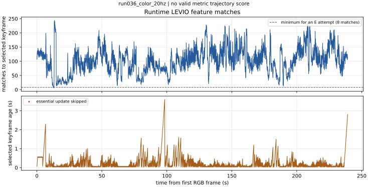
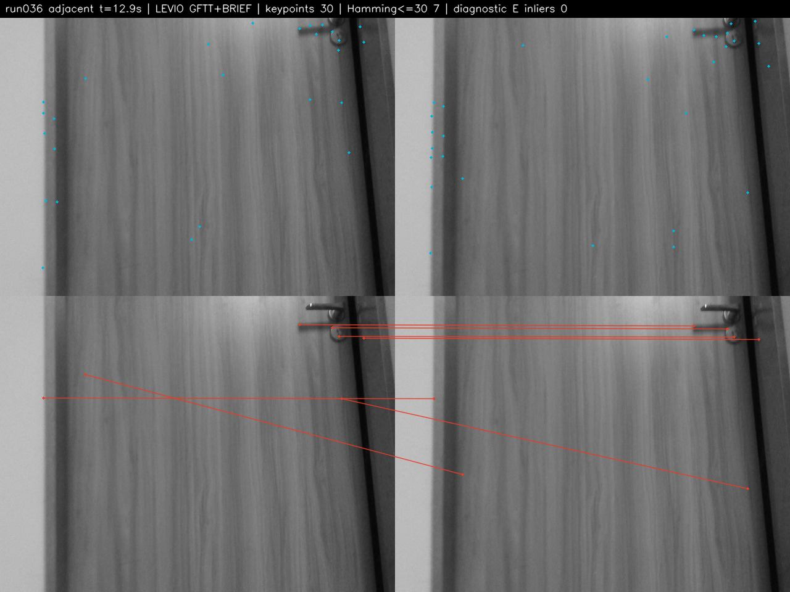
</details>

## 8. 结论与适用边界

**当前公开 Python 路径没有在该数据集上达到可稳定复现的论文级轨迹效果。** [LEVIO 论文表 V](https://arxiv.org/html/2602.03294)的 EuRoC MH01 为 0.96 m ATE RMSE；本报告已确认原 `main` 与研究分支在 MH01 的在线输出一致，但同一轨迹在这里的初始化后首位姿固定 RMSE 为 4.406 m，且即使事后做全程最佳 Sim(3) 仍为 2.068 m。论文的前端、调参和 RPG 轨迹评价细节与公开 Python 默认路径未完全对应，因此这是“未复现该表数值”的证据，不能据此断定论文表 V 有误。

在 odom_dataset，18 段完整 RGB/IMU 记录中 7 段未初始化，另 1 段在有效评分前已经发生 E 更新跳过。剩余评分段中，有 run007/010/021 等约 2 m 的短至中程全段 RMSE，也有 run003/011/020/032 的较大漂移和 run034 的四位数米级数值发散。run009 的唯一极短评分段与参考跳变重叠。等时长及 5 m 路程窗说明部分段的局部误差远小于全程累计误差；但 run034 在很短时间内已发散，故**序列较长只能解释部分差异，不能解释整体失效**。同理，参考跳变确实污染 run009/011/020 的局部评价，却不能解释 run032 的 PnP 大步或 run034 的发散。

逐帧证据排除了普遍 RGB 消息缺失或持续白屏：55,527 张实际 odom 输入图像中仅 56 张满足严重高亮判据，集中于 run016/020/021 的短事件；run021 的首次 E 失败恰好落在原始 RGB 已录为近饱和恒值的白帧上。其它 E 失效帧没有这种高亮，run032 还出现“679 个角点但仅 6 个相邻匹配”的暗场反例。相同 GFTT+BRIEF 前端在 EuRoC MH01 的邻帧匹配更丰富，且运行时几乎全程使用 PnP；多个新场景则长期退回 E 或无法初始化。故不同序列的失败机制有别，图像质量、关键帧选择、初态和后端异常应分别核查。

起始状态和时间处理也确实影响结果：18/18 段都把首关键帧时间改写为第二关键帧前 0.5 s，而 EuRoC MH01 不触发；保留真实时间使 run002 初始化，却使 run007 同窗结果变差、run034 仍发散。CLAHE 仅改善 run007 同窗而使 run021 丧失初始化；run007 的 ±15 ms 固定时间偏移也未改善。因此这些受控变体没有形成可推广的修复。`world` z 及未标定 ToF/深度无法提供可信离地高度，不能用“尚未起飞”概括未初始化段。D435i 彩色内参和模板外参已传入，但**模板外参质量、飞控 IMU 与相机的真实时偏、地图三维点和 PnP 内点质量尚未独立验证**。后续定位内因应记录每次 PnP 的三维候选/内点数、重投影误差和优化前后状态，并独立测量相机—飞控 IMU 外参与时偏。

所有米制轨迹图都只以首对位姿做一次 SE(3) 对齐，物理起点重合后才显示漂移；分窗图每窗重新设评价原点，但沿用同一在线 VIO 状态。EuRoC 对照使用独立运动真值，odom_dataset 仅有生成过程未获证实的记录融合里程计。由此，本报告能证明当前代码、输入和指定参考下的失败模式及结果量级，**不能声称新数据集的真值误差、论文实验协议的精确复现，或这些段对所有飞行任务的总体成功率**。
