# LEVIO Python 版在 odom_dataset 上的可复现实验

实验分支为 `research`。输入仅包含 D435i 的一只彩色相机和飞控原始 IMU；RGB 转灰度后作为单目图像，图像按 20 Hz 时间网格选帧，IMU 保持原始频率。深度、另一只相机、LiDAR 和记录里程计均不进入 LEVIO 估计。本文把 EuRoC MH_01_easy 作为原始代码对照，重点区分原始数据质量、视觉跟踪、视觉惯性初始化和评价协议。

## 1. 从容器到结果的复现顺序

在本仓库的 `research` 分支根目录执行；宿主机需要 Docker、Git、curl 和常规 shell/coreutils，无需安装 Python、ROS 或算法依赖。所有路径都在本仓库内。七段 odom bag 约 18 GB，EuRoC bag 约 2.7 GB；bag、日志和逐帧 CSV 放在已忽略的 `research_data/` 或 `research_results/`。

```bash
cd /home/dzp/projects/levio
docker build -f docker/research.Dockerfile -t levio-research:py310 .
research/download_bags.sh
research/download_bags.sh run023
research/download_euroc.sh
```

下载脚本固定 Hugging Face revision，按每段预期 SHA-256 验证，重新运行时复用已校验文件。`research/download_bags.sh` 默认只取六段有效录制；另下载 run023 用于核验剔除条件，不下载数据集其余几百 GB。

```bash
research/run_all.sh
# 仅复核剔除条件；脚本应输出 Skipping run023
research/run_all.sh run023
docker run --rm --user "$(id -u):$(id -g)" -v "$PWD:/workspace/levio" \
  levio-research:py310 python research/run_euroc.py \
  --output research_results/MH01_euroc_full \
  --trace-output research_results/MH01_euroc_full/runtime_match_trace.csv \
  > research_data/MH01_euroc_full.log 2>&1
docker run --rm --user "$(id -u):$(id -g)" -v "$PWD:/workspace/levio" \
  levio-research:py310 python research/plot_results.py \
  --run-dir research_results/MH01_euroc_full \
  --output research/figures/MH01_euroc_full.svg
```

`research/run_all.sh` 逐包运行输入审计、LEVIO、运行时匹配记录和绘图。每段的 `summary.json`、原始采集时间 `capture_times.txt`、逐帧当刻拷贝的 `online_frames.tum`、整段结束后的图状态 `frames.tum`、实际参与匹配的帧对 `runtime_match_trace.csv` 位于 `research_results/<run>_color_20hz/`。主指标和图只用 `online_frames.tum`。日志在 `research_data/`，最终图在 `research/figures/`；绘图程序检查与 `summary.json` 的一致性。

```bash
research/run_diagnostics.sh
research/run_ablations.sh
research/check_upstream_euroc.sh
docker run --rm --user "$(id -u):$(id -g)" -v "$PWD:/workspace/levio" \
  levio-research:py310 python research/check_alignment.py
docker run --rm --user "$(id -u):$(id -g)" -v "$PWD:/workspace/levio" \
  levio-research:py310 python research/summarize.py
docker run --rm --user "$(id -u):$(id -g)" -v "$PWD:/workspace/levio" \
  levio-research:py310 python research/make_source_brief.py
```

`run_diagnostics.sh` 重新生成七段完整相邻帧特征统计、三段统一 35 s 窗口的采样图、run003/run005 首次 E 失败点的原 OpenCV 调用结果、IMU/初始化审计、运行时分支汇总和初始化后前 10 s 的定长评价。`run_ablations.sh` 每次只改变一个指定条件；滤波 IMU 的负对照预期因重复时间戳失败，脚本会核查错误。`check_upstream_euroc.sh` 从原提交导出 Python 模型并与当前代码比较 EuRoC 前 300 帧及全段轨迹的逐字节输出。`check_alignment.py` 的合成检验要求起点误差为零、注入的终点误差为 0.25 m。

论文与既有调研对话的项目内摘要及小型 PDF 是 [source_brief.md](research/assets/source_brief.md) 和 [source_brief.pdf](research/assets/source_brief.pdf)。可以在容器中用 `python research/make_source_brief.py` 重新生成；`research/download_paper.sh` 可选下载论文原 PDF 至已忽略的 `research_data/`。以上命令不依赖 `/home/dzp/projects/odom_dataset` 的任何文件。

## 2. 数据、参考轨迹与标定

七段数据来自 [Hugging Face odom_dataset](https://huggingface.co/datasets/YangLiu1021/odom_dataset/blob/main/README.md)，revision 为 `6ac394eef603e8efbfdc9d15f718e85835eee6bb`。这七段随附的 session 元数据均标为 `quality.status: unchecked`；数据卡也未定义统一真值评测协议。项目内保存标定模板、session 元数据、逐段 bag SHA-256 和 [数据许可](research/DATA_LICENSE.md)。所有 bag 均有 `/camera/color/image_raw`（`rgb8`，640×480）、`/camera/color/camera_info` 和 `/mavros/imu/data_raw`（`base_link`，约 200 Hz）。

| Bag | 时长 (s) | 原始 RGB 帧 | 原始 IMU 条数 | 用途 |
|---|---:|---:|---:|---|
| run009 | 12.54 | 376 | 2,489 | VIO |
| run003 | 36.93 | 1,107 | 7,386 | VIO |
| run005 | 44.07 | 1,321 | 8,795 | VIO |
| run007 | 35.70 | 1,071 | 7,111 | VIO |
| run002 | 49.60 | 1,487 | 9,913 | VIO |
| run010 | 109.51 | 3,283 | 21,876 | VIO |
| run023 | 68.94 | 2,066 | 13,144 | 仅审计，不评价 VIO |

对比轨迹取 bag 中 `/fusion_odometry/lazy_point_odom`：`nav_msgs/Odometry`，`frame_id=world`、`child_frame_id=base_link`，发布者 `/fusion_odometry_on_ros`。它**不能确认为 LIO 真值**。公开数据卡片称其为 odometry，没有给出生成算法或独立精度；topic 名、发布者和 bag 内存在 LiDAR 均不能证明该轨迹由 LIO 生成。[TIO-Former 论文](https://arxiv.org/pdf/2609.17198)称其测试真值由外部动捕采集；当前公开 bag 中这条记录里程计未被证明就是该动捕真值。下文 odom 数值只表示 LEVIO 与**记录里程计参考**的差异。

相机内参逐包直接读取 `camera_info`，并核查同一 bag 内恒定。七段实测相同：`fx=603.508911`、`fy=603.285522`、`cx=334.385712`、`cy=250.231735`、`plumb_bob`、`D=[0,0,0,0,0]`；完整精度和使用的矩阵另存于各 `summary.json`。这取代了 EuRoC 默认 `fx≈458.654`、`fy≈457.296`。图像按 ROS `step` 解码，RGB 转灰度后按原前端处理。

项目内 [左红外标定模板](research/calibration/camera_infra1.yaml) 给出 `T_base_infra1`；每段 bag 的 `/tf_static` 给出 RealSense 内部变换。彩色相机外参按

```text
T_base_color = T_base_infra1 · inverse(T_link_infra1) · T_link_color
```

计算，七段的彩色相机在 `base_link` 下平移约 `[0.051764, 0.029380, -0.036306] m`。飞控原始 IMU 的 `frame_id=base_link`，故将 `T_base_color` 配给 LEVIO 的 `cam_to_imu_tf`，逆矩阵配给 `imu_to_cam_tf`。LEVIO 的测量坐标变换只用旋转，**没有**平移杠杆臂补偿。模板外参适用于全部 session 及相机与 IMU 固定时偏为零均未经联合标定验证。D435i 彩色相机为滚动快门，EuRoC 相机为全局快门；两组输入条件并不相同。这里输入的是飞控 IMU，而非 D435i 内置 IMU。

## 3. 输入时间轴审计与筛选

`audit_rgb.py` 检查原始图像 `header.stamp`、ROS 序号、bag 写入时间、编码及字节长度，同时检查原始 IMU 与参考轨迹的覆盖。`diagnose_frontend.py` 对完整录制按同一 20 Hz 网格取**相邻图像**，统计原 Python 前端的匹配。数值可由 `research/run_diagnostics.sh` 及 `research_results/rgb_audit/`、`research_results/frontend/*_full.json` 复核。

| Bag | 最大原始 RGB 帧间隔 (ms) | RGB 序号跳跃 / 非递增时间 / 长度异常 | 整段相邻帧匹配中位数 | 相邻帧匹配 ≥25 | IMU 末时刻 − RGB 末时刻 |
|---|---:|---:|---:|---:|---:|
| run002 | 33.749 | 0 / 0 / 0 | 158 | 100% | +0.066 s |
| run003 | 33.620 | 0 / 0 / 0 | 138 | 98.9% | +0.056 s |
| run005 | 33.684 | 0 / 0 / 0 | 130.5 | 98.4% | +0.058 s |
| run007 | 33.363 | 0 / 0 / 0 | 128 | 100% | +0.031 s |
| run009 | 33.675 | 0 / 0 / 0 | 226 | 99.2% | +0.035 s |
| run010 | 33.717 | 0 / 0 / 0 | 182 | 100% | +0.048 s |
| run023 | 33.401 | 0 / 0 / 0 | 273 | 100% | **−3.148 s** |

七段原始 RGB 均约 30 Hz，序号连续，时间戳严格递增，没有超过 50 ms 的间隔。按这些可观测证据，不能把 run005 的跟踪失效解释为录制漏掉长段 RGB。序号和时间戳连续不能证明曝光内容或相机与 IMU 的物理时钟完全正确。六段参考里程计有重复时间戳，但没有时间倒退；重复项的位置差最大为 0.054 mm，不足以解释米级偏差。run023 的 IMU 比 RGB 提前 3.148 s 结束，参考轨迹另有 15.37 s 时间间断，因此从**有效精度比较**中剔除；保留它的图像审计。其余六段输入时间覆盖合格，未完成初始化者仍作为算法失败案例。

## 4. 评价定义：共同起点与累计误差

每次 `process_frame` 完成后立即拷贝该时刻的相机位姿，形成不可被后续图优化回写的 `online_frames.tum`；整段结束后保存的 `frames.tum` 只用于源码输出比对。原始 RGB `header.stamp` 用于配对，避免静止起步分支改写首关键帧时间造成错配。参考按最近时间戳配对，最大误差 20 ms；记录里程计的机体位姿先乘 `T_base_color` 转到相机中心。只在**初始化后第一个成功配对**的帧计算一次 `T_align = T_ref,0 · inverse(T_est,0)`；其余帧只乘这个固定 SE(3) 变换，不拟合后续旋转、平移或尺度。故初始化后的预测与参考在图中三维起点和姿态重合，之后的差表示从同一初始位姿出发的在线累计偏差。截短运行与全段运行的相同 `online_frames.tum` 前缀由脚本逐字节检查，防止未来帧影响早期评价。

位置 RMSE 为匹配帧三维位置差的均方根；端点误差为最后一对位置差；EDR 为端点误差除以**同一评价窗口**参考路径长再乘 100%。路径长比是两条离散轨迹累计位移之比，轨迹跳变和抖动都会抬高它，不能当成单一尺度因子。全程最小二乘 SE(3) 对齐只作为诊断值：它使用未来轨迹，无法保证起点重合，也会改变开环漂移的解释。未完成视觉惯性初始化时，VO 平移没有可靠米制尺度，图仅展示跟踪状态，不绘制预测与参考的米制轨迹叠图，也不报告米制定位误差。

这个首帧固定口径与 [TIO-Former 图 5](https://arxiv.org/pdf/2609.17198)“从初始位姿出发的未对齐开环轨迹”在物理解释上相近，EDR 定义也相同；本文不是该论文的训练/测试集或 15 Hz ToF 评价复现。EuRoC 真值和 odom 记录里程计的证据等级不同，不能把两组 RMSE 当成同一排行榜。

## 5. 六段有效输入的在线 LEVIO 结果

表中“初始化帧”从零起算；“失效 E”是研究分支在本质矩阵无有效单解时保护性跳过的帧数。原版在该情形下可能异常终止；保护分支只保留位姿并继续诊断，不代表有效 VIO 更新。RMSE、端点和 EDR 只取初始化后、每帧当刻输出且**首次 E 失败之前**的匹配窗口；run003 的有效评分因此在第 705 帧前截止，后续帧仍用于失效审计。

| Bag | 处理帧 | 初始化帧 | 失效 E | 初始化后匹配帧 | 固定首位姿 RMSE (m) | 端点差 (m) | EDR | 路径长比 |
|---|---:|---:|---:|---:|---:|---:|---:|---:|
| run009 | 251 | — | 0 | — | — | — | — | — |
| run003 | 738 | 176 | 1 | 529 | 1.281 | 2.953 | 23.2% | 3.21 |
| run005 | 881 | — | 650 | — | — | — | — | — |
| run007 | 714 | 73 | 0 | 638 | 4.843 | 6.141 | 52.5% | 0.87 |
| run002 | 992 | — | 0 | — | — | — | — | — |
| run010 | 2,190 | 349 | 0 | 1,838 | 8.737 | 7.303 | 27.2% | 7.00 |

run003 在第 705 帧失效前的在线预测/参考累计路径长为 `40.90/12.75 m`，run010 全段为 `187.83/26.83 m`，两者有明显尺度或轨迹抖动差异。run007 为 `10.14/11.69 m`，但端点偏差仍达 `6.141 m`，说明路径长较接近不等于路径形状或方向正确。run023 不进入此表。

初始化成功的三张图，预测与参考的圆形起点严格重合；下排显示逐时位置差。未初始化的三张图只展示**实际运行时**当前帧到所选关键帧的匹配数与关键帧年龄；虚线是研究分支保护条件采用的 8 匹配门槛，不是 OpenCV 五点法的数学最小点数。

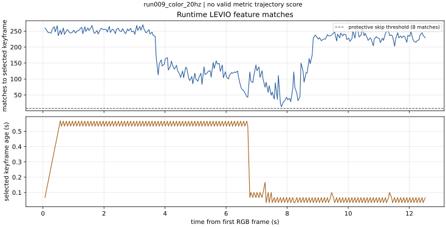
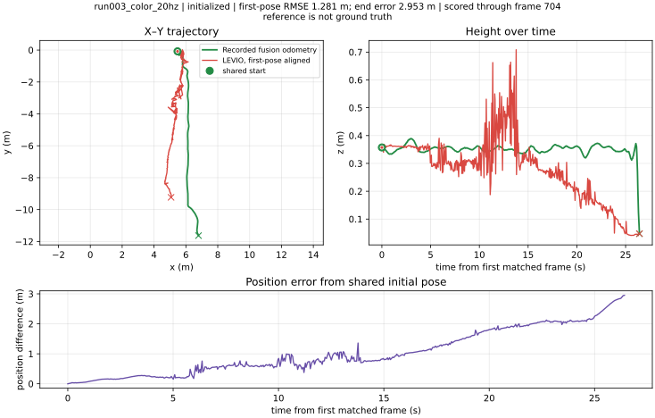
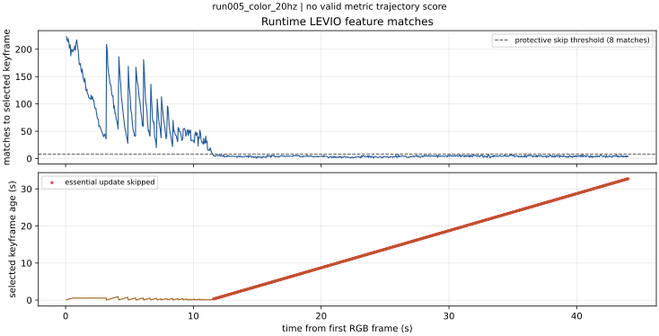
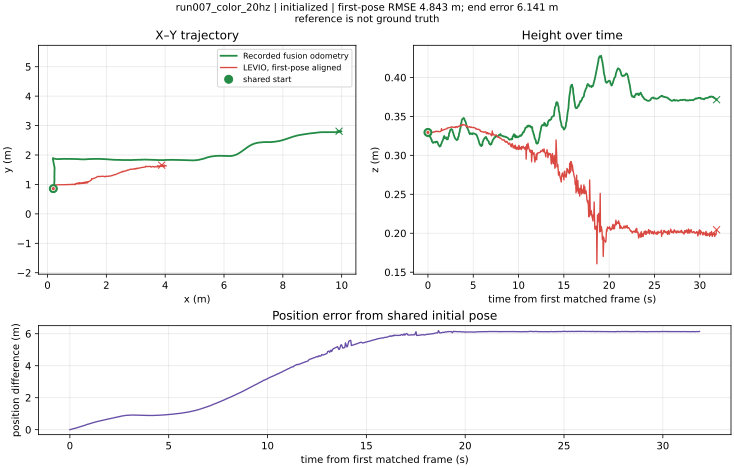
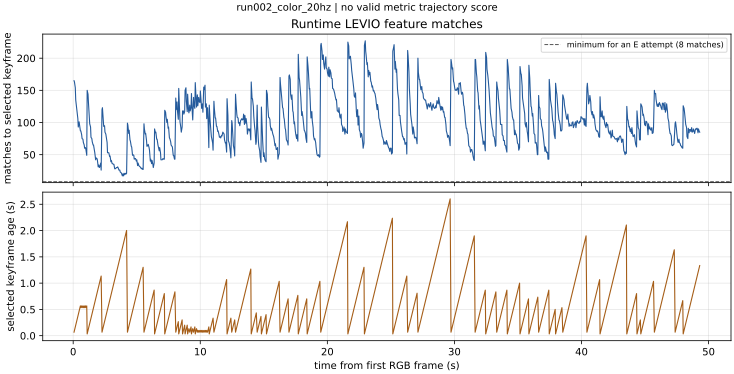
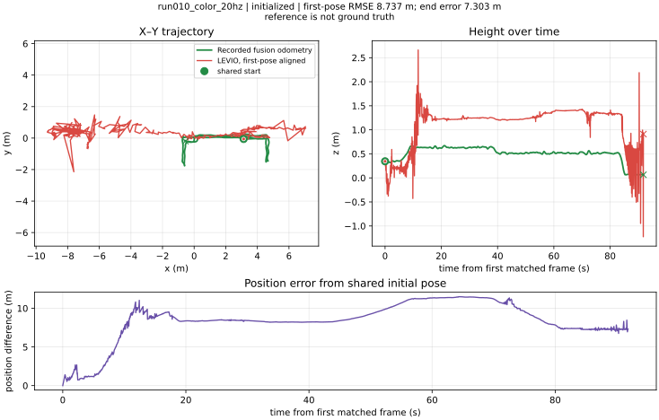

## 6. EuRoC 原始代码对照

[EuRoC 官方数据](https://projects.asl.ethz.ch/datasets/euroc-mav/)提供 20 Hz 图像、200 Hz IMU 和运动真值。只输入 MH_01_easy 左相机 `/cam0/image_raw` 与 `/imu0`；bag 来自 [Hugging Face 镜像](https://huggingface.co/datasets/kavehsgh/EuRoC_MAV_Dataset_Machine_Hall_Easy_01/tree/main)，revision `19434bff2188ded1943d3a01d5b5e6672afb117e`，真值 CSV 来自固定版本 [OpenVINS 镜像](https://github.com/rpng/open_vins/blob/69488123ed9362dd44b6f28e7f4680abbff1442b/ov_data/euroc_mav/MH_01_easy.csv)，两者 SHA-256 由下载脚本检查。保持原项目 EuRoC 内参、畸变和相机—IMU 外参；真值的 IMU 位姿转换到相机中心。评测时间匹配和首位姿固定方法与 odom 一致。

全段处理 3,682 帧，31 帧初始化，之后 3,630 帧配对；在线固定首位姿 RMSE `4.406 m`，端点误差 `2.700 m`，预测/真值路径长 `149.03/80.28 m`。若对同一在线输出做全程事后最佳 SE(3) 对齐，RMSE 为 `2.470 m`；后者不用于开环主结论。单独截短的前 300 帧在初始化后 RMSE 为 `0.119 m`、端点差 `0.238 m`；短窗口不能代替全段性能。

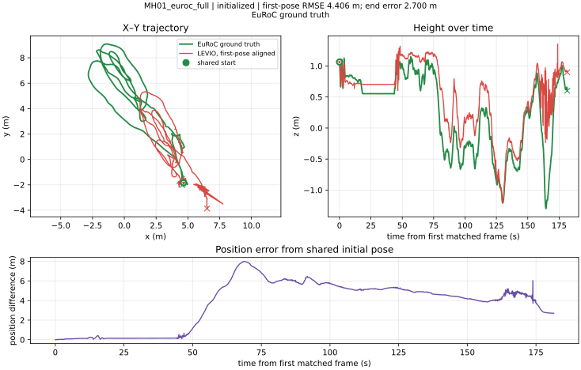

`check_upstream_euroc.sh` 导出原始提交 `00d925f166bff859496fbda85049b2ce68bf7aa1` 的 Python 模型，在同一容器和 bag 中分别跑前 300 帧及全段，逐字节比较最终 `frames.tum`、`keyframes.tum` 和在线 `online_frames.tum`。全段三者的 SHA-256 依次为 `47113fa3595e06ffa40158498464cdae674ca5985e201327b0285213476eb9ec`、`69bd4714d90100728002629db10f7f9cfeedfd8cca86ccc3d2a34e73b5b56152`、`d7f4956a59b895295d452aa2ae18a79c1ed8c7712fc6d2e77dc2f1c2236191a0`，两版各文件相同。前 300 帧的在线文件也与全段运行的对应前缀逐字节相同。这证明适配没有改变**EuRoC 默认路径**的输出，不能证明已经复现论文调参后的性能。

## 7. 控制变量：视觉、关键帧与 IMU

### 相邻图像特征

三组均取录制开始后前 35 s，20 Hz，使用当前 Python 前端的 GFTT、BRIEF、交叉检查 Hamming ≤30、相同的本质矩阵 RANSAC 流程；分别使用各自真实相机标定去畸变。统计只涉及**时间相邻的模型输入图像**。原始 RGB 为 30 Hz，按时间网格取到 20 Hz 后相邻输入间隔可为约 33 或 67 ms；run005 第 30 秒所示两帧间隔为 66.65 ms。图片上半部为两帧特征，下半部为最多 70 条匹配，绿色是 E 内点，红色是外点。

| 输入，前 35 s | 每帧特征中位数 | 8×6 网格占用中位数 | 相邻帧匹配中位数 | E 内点中位数 | `recoverPose` 正深度内点中位数 / p90 | ≥25 匹配比例 |
|---|---:|---:|---:|---:|---:|---:|
| run005 RGB | 153 | 35/48 | 109 | 97 | 3 / 31 | 98.0% |
| run007 RGB | 195 | 37/48 | 126 | 110 | 4 / 36 | 100% |
| EuRoC MH01 | 606 | 47/48 | 371 | 325 | 9 / 181 | 100% |

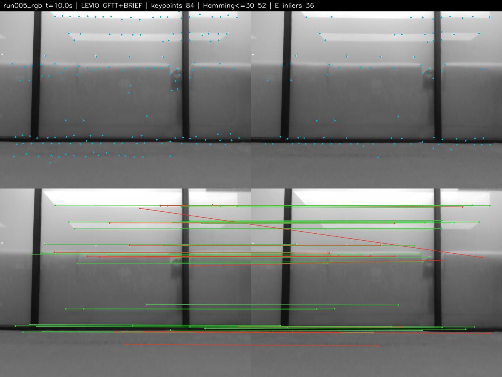
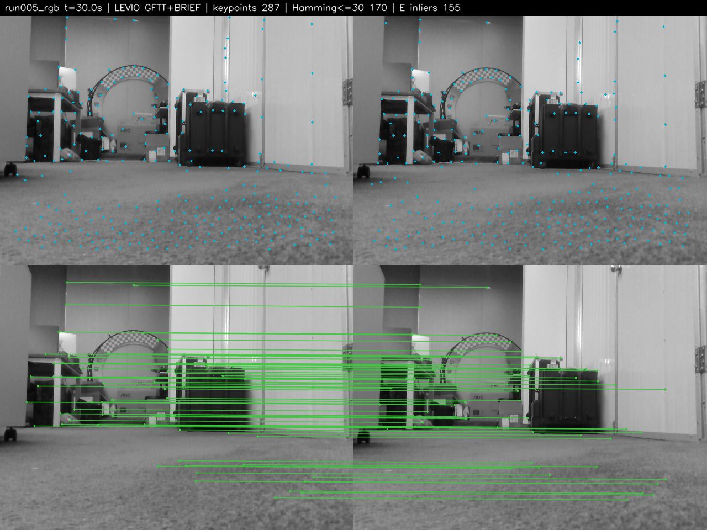
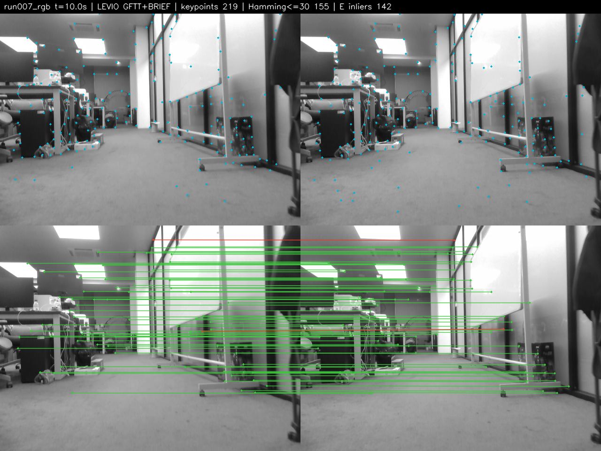
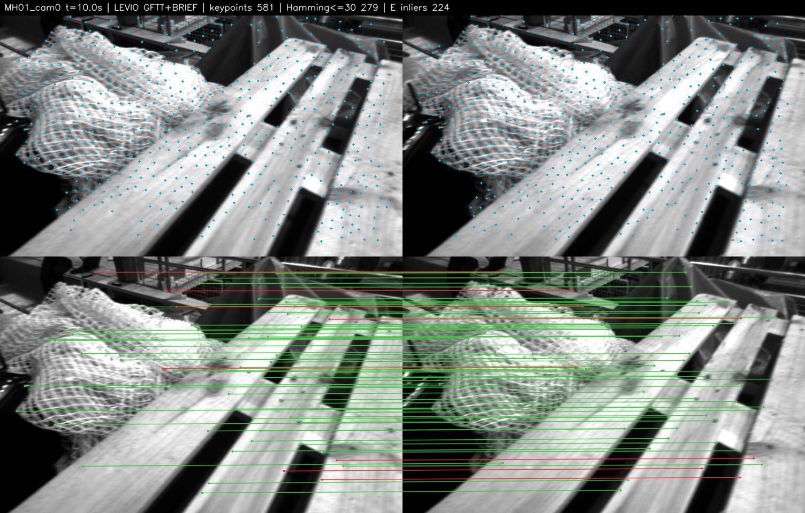

EuRoC 此窗口的可重复特征更多，图像场景和传感器也不同，不能把数量差全部归因于 RGB 相机。`recoverPose` 中位数在两组都低；“E 内点多”并不等于每帧都得到可靠平移视差。run005 的全段相邻帧中位数说明多数时段可匹配，**不能排除局部短时视觉退化**，也不说明完整 VIO 必然成功。

### 运行时实际选用的帧对

`runtime_match_trace.csv` 通过包装原函数记录当前帧、**代码实际选中的最后关键帧**、匹配数、PnP 是否被模型接受和 E 更新状态，返回值未改变。其和相邻图像的离线统计是两个不同对象。run005 第 30 秒的特征图仅展示**相邻输入图像**；原先相隔 18.8 s 的两帧图已移除，不能被当作正常相邻帧比较。

| 输入 | 运行时所选关键帧匹配中位数 | 关键帧年龄中位数 / 最大值 (s) | 模型接受的 PnP 帧 | E 更新跳过帧 |
|---|---:|---:|---:|---:|
| run002 | 96 | 0.53 / 2.41 | 5 | 0 |
| run005 | 5 | 10.77 / 32.76 | 0 | 650 |
| run007 | 79 | 0.93 / 12.28 | 523 | 0 |
| EuRoC MH01 | 234 | 0.30 / 24.25 | 3,621 | 0 |

run005 最后一个关键帧是第 225 帧。第 231 帧附近相机对着低纹理墙面：当前帧只有 35 个特征点，与**上一输入帧**（间隔 66.7 ms）仅匹配 6 点，与最后关键帧（间隔 0.300 s）仅匹配 5 点。两种近时间间隔的对应都不足，证明最初是短时视觉约束退化，不能把它归咎于旧关键帧已相隔十几秒。

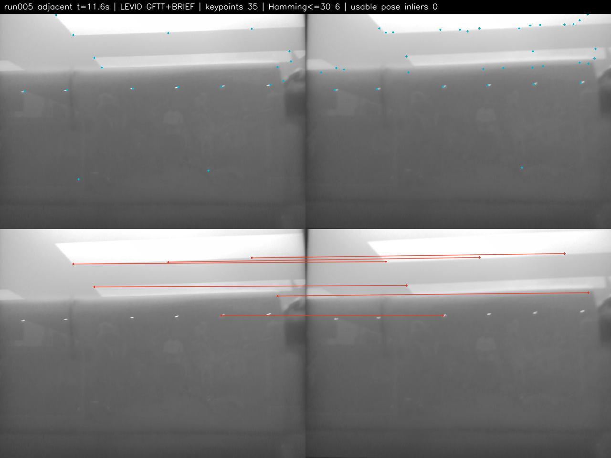
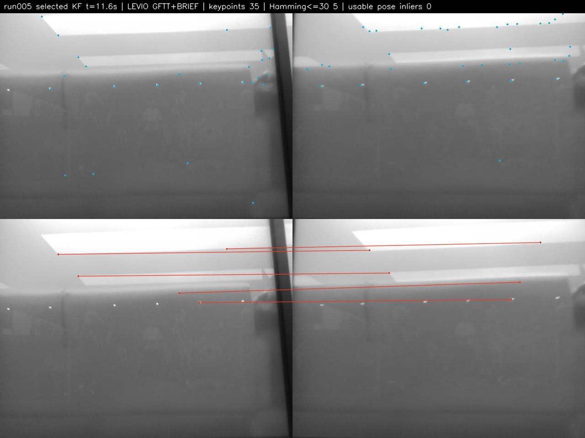

两张失效图标题中的 `usable pose inliers 0` 表示没有可交给 `recoverPose` 的有效单解，不表示原始匹配不存在。`check_essential_threshold.py` 用关键帧的 5 对真实特征直接调用原代码的 OpenCV 过程：`findEssentialMat` 返回 `6×3` 多解矩阵，紧接着 `recoverPose` 因要求 `3×3` 单解而报错。原代码在这里会中止；研究分支的保护条件将其记为失败并保留旧位姿，以便继续审计后续传感器帧。由于该段没有被模型接受的 PnP 路径，第 231 帧及其后共 650 帧保护性跳过 E 更新，仍无法新增关键帧；到末帧旧关键帧年龄累积为 32.76 s。第 30 秒**相邻**输入图像已恢复到 170 个匹配、155 个 E 内点，但模型仍使用第 225 帧关键帧。这表明低纹理时段触发的跟踪失败没有恢复；不能把后来相隔 18.8 s 的两张图误当成正常相邻帧，也不能把它误判为 RGB 漏录。EuRoC 即使偶有较老关键帧，也主要由已建立三维地图的 PnP 分支维持跟踪。

run003 第 705 帧与第 704 帧关键帧只匹配到 2 点；原 OpenCV 调用返回空 E，原代码随后访问空 mask 也会报错。因此该段的轨迹指标严格截止在第 705 帧之前，不能把保护性续跑的最后 33 帧计入原算法性能。

### IMU 时间与初始化

统一前 35 s 的消息审计如下；最近图像—IMU 时间差只描述可观测的时间戳距离，**不能**证明固定时钟零偏为零。

| 数据及 IMU | IMU 间隔中位数 / p99 (ms) | 最近图像—IMU 差中位数 / p99 (ms) | 加速度模长中位数 (m/s²) | 角速度模长中位数 (rad/s) | 非递增时间 |
|---|---:|---:|---:|---:|---:|
| run005 原始 | 4.56 / 7.01 | 1.27 / 3.11 | 9.799 | 0.079 | 0 |
| run007 原始 | 4.94 / 10.55 | 1.27 / 3.79 | 9.824 | 0.066 | 0 |
| run007 滤波 | 4.00 / 10.49 | 1.29 / 4.44 | 9.824 | 0.066 | 1 个重复时间戳 |
| EuRoC MH01 | 5.00 / 5.00 | 0 / 0 | 9.785 | 0.127 | 0 |

原始 IMU 无非递增时间且量纲正常；EuRoC IMU 采样更规则。run007 改用 `/mavros/imu/data` 会在第 189 帧因 `dt <= 0` 中止，所以它不是有效的 IMU 精度替换实验。上述角速度统计提示不同运动激励，但不足以单独证明初始化可观性。

原 Python 代码以“第二关键帧 id >10”判断静止起步，并将首关键帧时间改到第二关键帧前 0.5 s；从 bag 原始首图时间计算得到：

| Bag | 实际首帧至第二关键帧 (s) | 模型保存的间隔 (s) | 该区间记录里程计净位移 (m) |
|---|---:|---:|---:|
| run002 | 1.201 | 0.500 | 0.770 |
| run003 | 1.201 | 0.500 | 0.569 |
| run005 | 3.169 | 0.500 | 0.552 |
| run007 | 1.501 | 0.500 | 0.062 |
| run009 | 6.710 | 0.500 | 0.110 |
| run010 | 8.273 | 0.500 | 0.116 |

run002/003/005 的记录位移与静止起步假设矛盾，尽管记录里程计不是独立真值。下面仅在指定变量上做改动；run002 两次使用相同前 300 帧，不能把它们的短窗口误差与默认全段直接比较。

| 条件 | 初始化 | 固定首位姿 RMSE (m) | 端点差 (m) | 路径长比 | 可支持的判断 |
|---|---:|---:|---:|---:|---|
| run002 默认，全段 | — | — | — | — | 未获得米制尺度 |
| run002 保留首帧时间，前 300 帧 | 183 | 0.368 | 0.413 | 6.05 | 初始化决策改变，路径仍失真 |
| run002 一般初始化，前 300 帧 | 183 | 0.552 | 0.544 | 9.23 | 初始化决策改变，路径仍失真 |
| run007 默认，全段 | 73 | 4.843 | 6.141 | 0.868 | 原配置 |
| run007 关闭 GTSAM 优化，全段 | 73 | 7.132 | 9.586 | 0.075 | 后端对该段米制尺度有贡献 |

run007 的采样率对照固定 RGB、原始 IMU、bag 和其余参数，只把 RGB 选帧由 20 Hz 改为 15 Hz。另一组 15 Hz 对照改变相机话题及对应标定；RGB 和左红外的视角、曝光与帧时间也不同，结果不能归因于单一“颜色”因素。两组 15 Hz 输出位于 `research_results/run007_{color,infra1}_15hz/`。

| 相机与选帧 | 处理帧 | 初始化帧 | 固定首位姿 RMSE (m) | 端点差 (m) | 路径长比 |
|---|---:|---:|---:|---:|---:|
| RGB 20 Hz | 714 | 73 | 4.843 | 6.141 | 0.868 |
| RGB 15 Hz | 536 | 57 | 1.276 | 1.268 | 2.48 |
| 左红外 15 Hz | 535 | — | — | — | — |

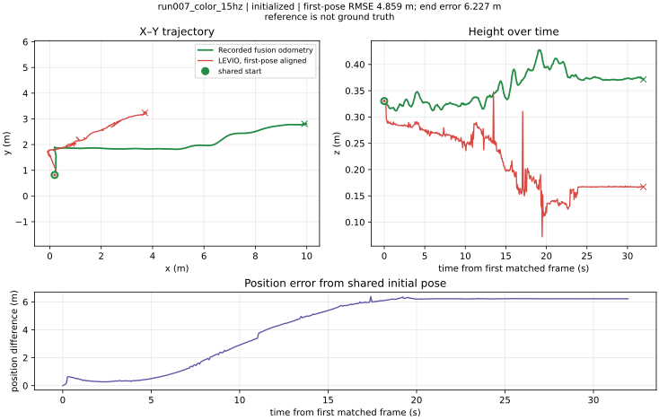
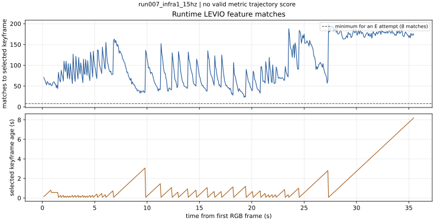

RGB 15 Hz 端点更接近参考，但累计路径长仍是参考的 2.48 倍；这种取样敏感性与轨迹抖动均不支持仅凭端点差判定配置已经稳定。左红外不初始化说明更换图像流和标定能改变运行结果，不能据此认定 RGB 或 IMU 单方有错。

run010 另固定相同前 600 帧，只关闭初始化后的图优化；在各自初始化后的同一 10 s 窗口评价。这组控制证明轨迹跳变并非由后端优化单独制造，关闭它反而更差。

| run010 前 600 帧 | 在线首位姿 RMSE (m) | 端点差 (m) | 预测/参考路径长 (m) | 预测单步 p99 (m) |
|---|---:|---:|---:|---:|
| 原配置 | 3.094 | 7.275 | 46.38 / 2.87 | 1.404 |
| 关闭图优化 | 11.875 | 26.037 | 306.12 / 2.87 | 12.561 |

同一原配置的前 600 帧与全段运行的 `online_frames.tum` 前缀逐字节相同；全段结束后的 `frames.tum` 则可能回写历史关键帧，故不用于上述在线评价。

## 8. 定长窗口与论文量级

为减少“不同段长度”影响，`compare_fixed_window.py` 在每段初始化后第一个匹配帧重新固定共同起点，仅评价随后的约 10 s；同一持续时间仍对应不同运动距离和环境。EuRoC 参考为独立真值，odom 参考精度未证实，因此这张表用于定位现象，不作严格跨数据集精度排名。

| 输入，初始化后约 10 s | 匹配帧 | 固定首位姿 RMSE (m) | 端点差 (m) | 参考路径长 (m) | 预测路径长 (m) | 预测单步 p99 (m) | EDR |
|---|---:|---:|---:|---:|---:|---:|---:|
| EuRoC MH01 | 201 | 0.087 | 0.134 | 3.576 | 3.451 | 0.045 | 3.8% |
| run003 | 200 | 0.399 | 0.804 | 2.494 | 9.227 | 0.330 | 32.3% |
| run007 | 200 | 1.463 | 3.161 | 4.676 | 0.823 | 0.015 | 67.6% |
| run010 | 201 | 3.094 | 7.275 | 2.870 | 46.380 | 1.404 | 253.5% |

run010 的 10 s 预测累计路径长异常大，预测相邻帧位移 p99 达 1.404 m、最大 2.480 m；这说明存在显著轨迹跳变，也解释了为何只报端点或全程最佳对齐 RMSE 都不足以描述轨迹质量。[LEVIO 论文表 V](https://arxiv.org/html/2602.03294)对 EuRoC MH01–MH05 标准分辨率报告的 ATE RMSE 为 `0.96、0.92、3.69、8.33、3.38 m`。论文的 Python golden model 经参数搜索，使用 RPG trajectory evaluation；论文描述 ORB/8-point，当前仓库 Python 默认实际为 GFTT+BRIEF/OpenCV `findEssentialMat`。本实验 EuRoC 默认模型的全段固定首位姿 `4.406 m` 和全程事后 SE(3) 对齐 `2.470 m`，评价协议均未证明与表 V 一致，不能宣称严格复现或直接反驳论文的 `0.96 m`。

## 9. 结论

1. 七段 bag 均含连续 RGB 与飞控 IMU；run023 因 IMU 提前结束、参考轨迹间断而被剔除。run005 的视觉失效不是可由原始 RGB 序号或时间戳证明的漏帧。
2. D435i 彩色内参已从各 bag 读入；外参采用发布模板与 bag TF 的组合。固定时偏、模板适用性和杠杆臂补偿仍未验证，故不能据此宣布跨传感器标定完全正确。
3. run005 在第 231 帧的低纹理区域，66.7 ms 相邻输入也只剩 6 个匹配；对 0.300 s 前关键帧为 5 个。原版 OpenCV 路径在多解 E 输入 `recoverPose` 时异常，保护性续跑没有重新捕获关键帧，虽然之后相邻帧匹配恢复。这是该段未初始化的可观察失效链；十几秒的旧关键帧间隔是后果。EuRoC 可持续获得更多特征及 PnP 接受帧；差异涉及场景、相机和模型分支，不能单独归结为 RGB 模态。
4. run002/009 即使有相邻视觉匹配也未初始化；run009 仅 12.54 s，不能单凭这段判定具体失败原因。run002 的静止起步时间捷径消融能改变初始化但不能恢复可信路径尺度。run007 和 run010 关闭后端后均明显退化，说明惯性/图优化确有作用；同一 RGB 从 20 Hz 改到 15 Hz 又使端点差大幅改变但路径长仍失真。已初始化的 run003/007/010 与记录里程计存在米级偏差或路径异常。尚不能从这些观测唯一确定外参误差、时偏、运动激励和后端模型各自的贡献。
5. 未修改的原始 Python 模型在 EuRoC MH01 前 10 s 表现较好，但全段也有明显漂移，且与当前研究代码的 EuRoC 输出逐字节相同。**当前 odom_dataset 实验不支持“达到论文性能量级”的结论**；论文参数与评价协议不同，公开 odom 参考又未被证明为独立真值。可确认的结论是：在这六段有效输入上，该默认 Python 配置的初始化可靠性和相对记录里程计的轨迹一致性不足。
